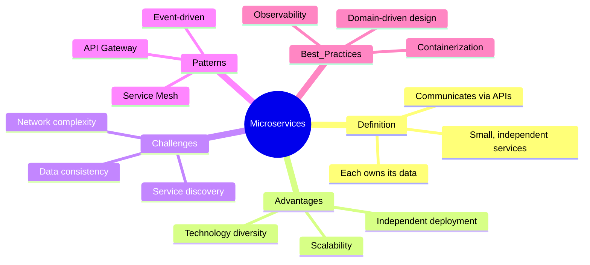
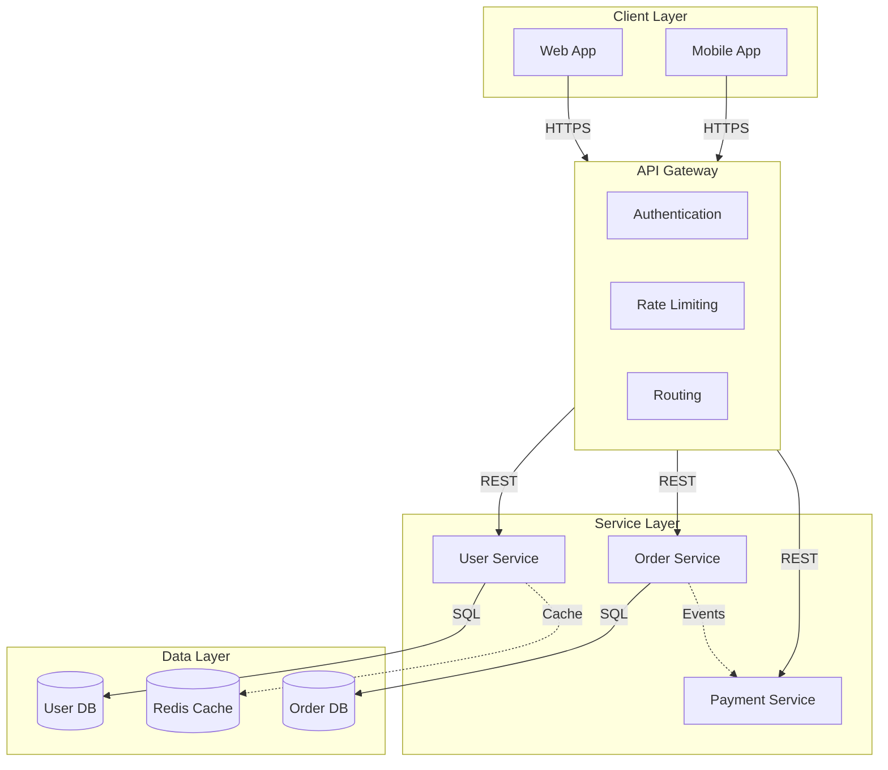
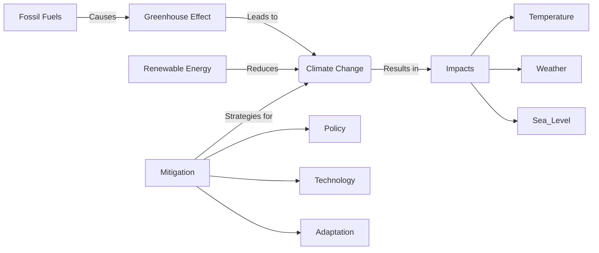

# Concept Mapper - Examples

Complete Mermaid examples for each use case.

## Example 1: Learning Mind Map (Study)

**User Request:** "Create a mind map for learning about microservices"

## Example 2: System Architecture Map

**User Request:** "Map out a web application architecture"

## Example 3: Text to Concept Map

**User Request:** "Convert this article about climate change into a concept map"

**First: Extract Key Concepts**
- Climate Change (central)
- Greenhouse Effect (mechanism)
- Fossil Fuels (cause)
- Renewable Energy (solution)
- Impacts (consequences)
- Mitigation (actions)

