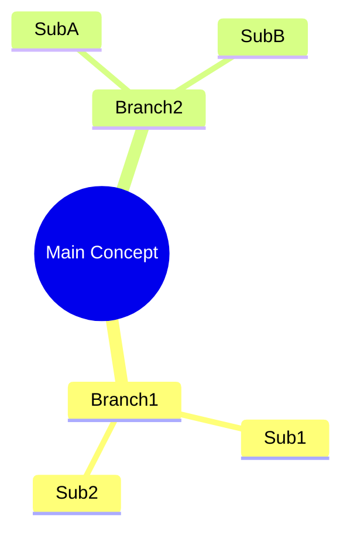

# Concept Mapper - Mermaid Syntax Guide

Syntax conventions for each diagram type supported by this skill.

## Mind Maps (Learning/Brainstorming)

- Use `mindmap` type
- Center concept in `((double parentheses))`
- Branch radiates outward
- Add icons with emojis sparingly (books, lightbulb, warning)

## Concept Maps (Relationships)

- Use `graph LR` (left-to-right) or `graph TD` (top-down)
- Label relationships on arrows: `Concept1 -->|causes| Concept2`
- Use shapes: `[rectangle]` for concepts, `((circle))` for central ideas, `{diamond}` for decisions

## Architecture Diagrams (Systems)

- Use `graph TB` (top-down) or `graph LR` (layered)
- Group components: `subgraph Layer [Layer Name]`
- Label connections: `ComponentA -->|HTTP| ComponentB`
- Use shapes: `[rectangle]` for services, `[(cylinder)]` for databases, `((circle))` for external systems
