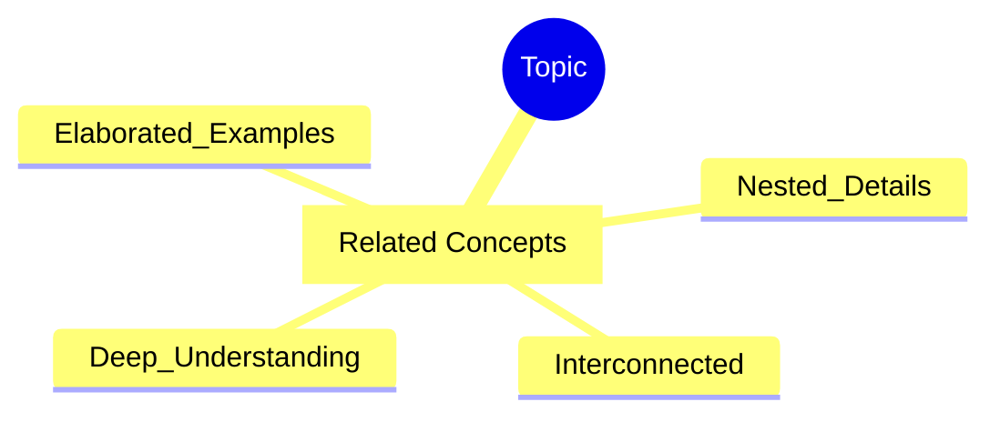
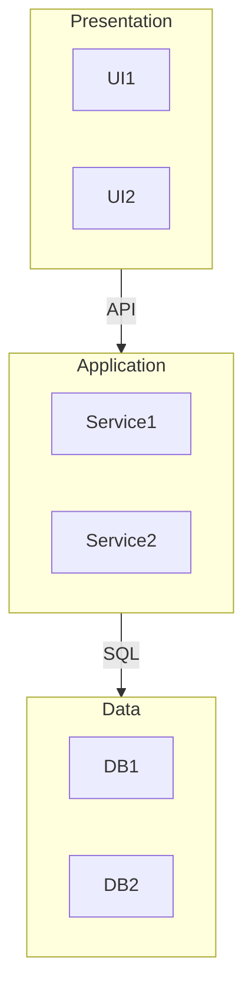
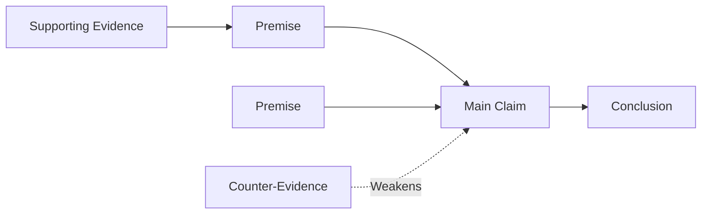

# Concept Mapper - Templates & Advanced Techniques

Ready-to-use Mermaid templates and advanced techniques for complex maps.

## Templates

### GRINDE Study Map Template

For learning/study maps using the GRINDE framework (Group, Related, Interconnected, Nested, Deep, Elaborated).

### Three-Tier Architecture Template

For system architecture diagrams showing presentation, application, and data layers.

### Argument Analysis Template

For converting text/articles into argument structure maps.

## Advanced Techniques

### For Complex Systems
- Use nested subgraphs for layers
- Add legends or keys
- Use different arrow styles for different relationship types
- Color-code by subsystem or concern

### For Learning/Studying
- Add memory hooks (mnemonics, analogies)
- Include "don't confuse with" branches
- Add practice questions or self-tests
- Link to related topics

### For Text Analysis
- Distinguish between claims and evidence
- Show argument structure (premise -> conclusion)
- Highlight controversial points
- Include citations or references
