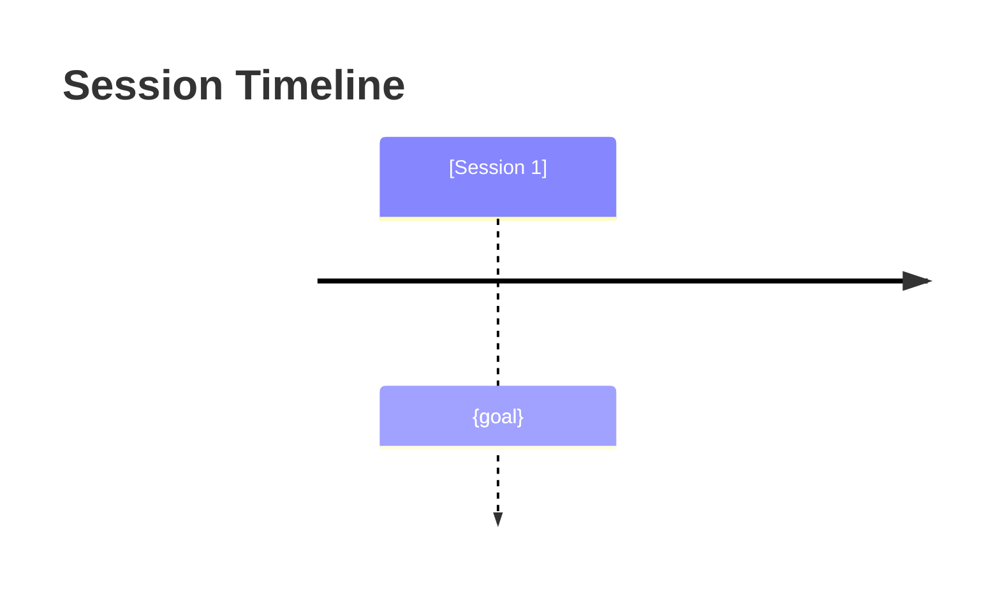
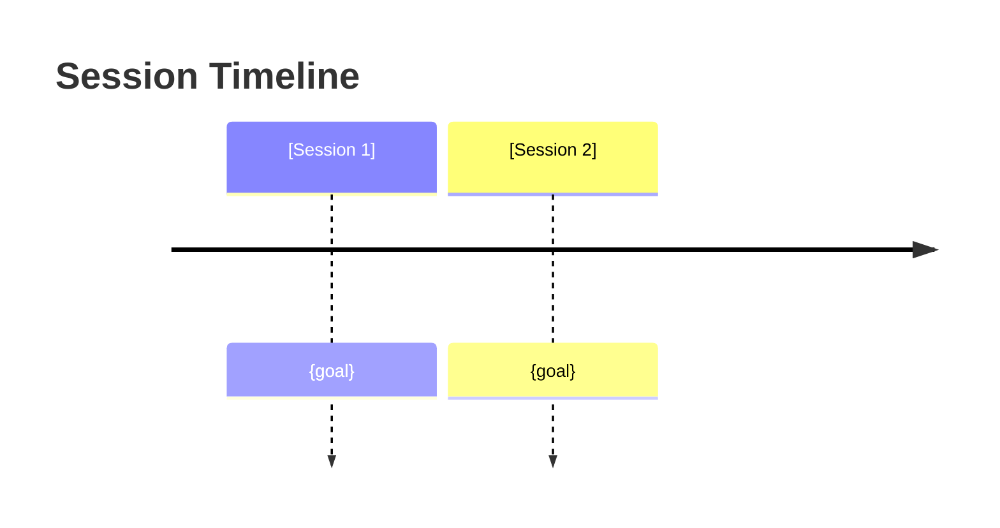
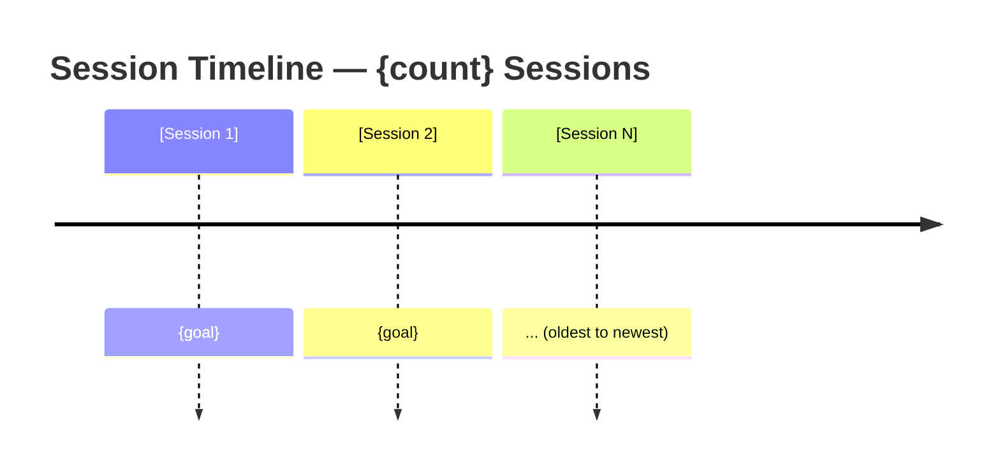

# /recap — Terminal-Wide Session Catch-Up

**Problem solved:** "I have 10 sessions compaction-deep in this terminal and I need to know what happened."

## Core Concept

`/recap` aggregates context from ALL sessions in this terminal by directly analyzing the transcript file. Session boundaries are detected via `sessionId` changes in the transcript. No handoff files required — works independently.

## How It Works

**IMPORTANT — LLM Executor:** If you are the LLM with full conversation context in memory, skip the transcript search and proceed directly to synthesizing findings from context. Only search for transcript files when resuming a prior session without current context.

1. **Find transcript file**: Searches terminal file registry, project-local, and user-level transcript locations
2. **Parse transcript**: Loads JSONL transcript file directly
3. **Detect session boundaries**: Identifies sessions by `sessionId` changes in transcript
4. **Aggregate context**: Extracts goals, message counts from each session
5. **Present summary**: Shows chronological session history

> **⚠️ Fallback behavior**: If the session chain index is unavailable (e.g., `core.session_chain` import fails), the primary path falls back to reading only the current terminal's transcript file directly — it cannot reconstruct the full multi-session terminal history. The synthesis step will have less context to work with.

## Output Structure

The script extracts structured data via regex and presents it in a format compatible with handoff best practices.

### Script Output (aligned with `/handoff` template)
```
# Terminal Recap: {terminal_id}

## Session Metadata
- **Total Sessions**: {count}
- **Terminal ID**: {terminal_id}
- **Current Session**: {session_id}
- **Project**: {project_path}

### Session Timeline (Mermaid)
When the session history has any entries, output one of the following diagrams for at-a-glance orientation:

**For 1 session:**


**For 2-4 sessions:**


**For 5+ sessions:**


## Session History

[Session 1] {session_id}
- **Entries**: {n}
- **User messages**: {n} / Assistant messages: {n}
- **Duration**: {duration if available}
- **Goal**: {goal}

### Original Request
- **User Request**: "{extracted request}"
- **Trigger**: {trigger context}

### Session Objectives
- **Objective 1**: {objective} ({status})
- **Objective 2**: {objective} ({status})

### Final Actions Taken
- **Action A** ({priority})
- **Action B** ({priority})

### Outcomes
- **Outcome 1**: ({status})
- **Outcome 2**: ({status})

### Active Work At Handoff
- **Currently Working On**: {work description}
  - Status: {status}
  - Files Modified: {file_list}
  - Next: {next_step}

### Working Decisions (Critical for Continuity)
- **Decision**: {decision}
  - **Rationale**: {reason}
  - **Impact**: {high|medium|low}

### Current Tasks
- **#{id}**: {task description} ({status}, {priority})

### Known Issues
- **ISSUE-1**: {description} ({status}, {priority})

### Open Questions / Parking Lot
- **Question**: {question text}? ({priority}, {type})
  - *Urgency*: High/Med/Low — what would need to be true to decide this?

### Knowledge Contributions
- **Insight**: {contribution}

### Next Immediate Action
1. {action_1}
2. {action_2}

### Parking Lot (Inversion)
*What would guarantee this session's work fails?* Surface it here.
- **Failure Mode**: {description} — *Mitigation*: {what would prevent it}
- **Assumption**: {core assumption} — *Invalidates*: D# or Action#
- **External Block**: {dependency} — *Blocks*: Action#

### Raw Context
{condensed text for full transcript access}
```
> **⚠️ Note:** The `### Raw Context` section is condensed by `_condense_transcript()` with a 2000-character budget per session. Content beyond that limit is silently dropped — the structured fields above are the primary evidence source. Full transcript access requires reading the raw transcript file directly.


### Response Synthesis (LLM task after script output)

When responding to `/recap`, apply reasoning to the script output plus the raw transcript context. For each session, synthesize:

**Cynefin Domain**: Classify the problem type for each session:
- **Clear**: Routine task, obvious solution (e.g., config edit, simple refactor)
- **Complicated**: Requires analysis or expert knowledge (e.g., debugging, architecture)
- **Complex**: Emergent behavior, no single right answer (e.g., integration issues, conflicting requirements)
- **Chaotic**: Novel situation, no clear precedent (e.g., debugging mystery bugs, first-of-kind work)

**Problem**: What was the underlying issue? Not just the symptom — the root cause.

**What was done**: What actually changed (file edits, hooks, skills, configs). Be specific about the actual action.

**Optimal fix**: What would the ideal solution have been? This may differ from what was done. Consider:
- Was the fix a workaround vs. root cause resolution?
- Was the approach optimal given the constraints?
- Was anything missed or left incomplete?

**Contract/resume gaps**: What assumptions were left unstated or unverified? Explicitly surface:
- unresolved producer/consumer assumptions
- incomplete handoff or restore logic
- “discussed” vs “actually verified”
- missing proof that resume/consumer paths really worked
- missing, stale, or ignored `Contract Authority Packet` state for contract-sensitive work

Present synthesis as a per-session narrative in the response, not replacing the script output but complementing it.

## Usage

```bash
/recap                    # Show full terminal recap (current + history)
/recap brief              # Show brief catch-up summary only
```

## Routing Behavior

`/recap` may suggest lower skills when the reconstructed session history shows missing gates:

- suggest `/gto` when current gaps or stale assumptions are unclear
- suggest `/design` when unresolved state or contract decisions appear in prior sessions
- suggest `/verify` when work was discussed or implemented but not actually proven
- suggest `/pre-mortem` when sessions are classified Complex or Chaotic (risk escalation)
- suggest `/chat-to-decisions` when open items from the Parking Lot need formal ADR output

`/recap` should not implement fixes itself.

## Catch-Up Integrity Prompts

Before synthesizing a catch-up summary, `/recap` should run a short internal catch-up integrity check:

- What part of this recap is being inferred from condensed transcript fragments rather than strong evidence?
- What session outcome might be stale, incomplete, or contradicted by later sessions in the same terminal chain?
- What assumption, contract gap, or resume risk is still implicit rather than explicitly surfaced?
- What event in the session chain changed the direction of work, and have I preserved that turning point accurately?
- What recommendation would be misleading if the transcript fallback lost important context?
- What issue was discussed but never actually verified or completed?
- What would a weaker model compress away that materially changes the summary?
- What gap belongs to `/design`, `/planning`, or `/verify` rather than being presented as a local recap observation?
- What summary statement is too confident given the available transcript evidence?
- What would make this recap locally coherent but globally wrong across the full session chain?

These are internal self-check prompts. They are not default user-facing questions and should only surface to the user when `/recap` is genuinely blocked and cannot proceed safely without clarification.

## Implementation Notes

- Finds transcript files via `~/.claude/terminals/` registry file (deprecated — prefer env vars)
- Parses JSONL transcript files directly (no handoff package dependency)
- Detects session boundaries via `sessionId` field changes
- Independent of handoff hooks and task tracker files
- Semantic extraction (problem/fix/action) via regex against structured output patterns (bugfixes.md format)
- Synthesis (optimal fix reasoning) is performed by the responding LLM — not in preprocessing
