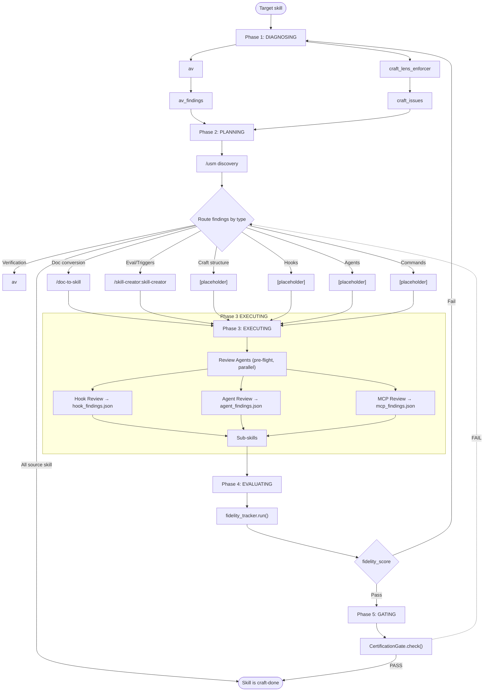

# skill-craft — Unified Skill-Craft Orchestrator

Coordinates skill improvement through a 5-phase pipeline: **diagnosing → planning → executing → evaluating → gating**.

## Mermaid Diagram Authoring

When creating documentation diagrams, produce mermaid that is **readable, minimal, and almost never has crossing lines**.

### Layout Rules

| Rule | Why | Enforce with |
|------|-----|--------------|
| **Direction matters** | TD (top-down) keeps phases vertical; LR (left-right) is good for state machines | `flowchart TD` or `flowchart LR` |
| **Group by phase** | Nodes that share a conceptual phase should share a rank (same vertical column) | Order nodes so related nodes appear on the same rank |
| **Avoid crossing edges** | Crossing lines create cognitive load and obscure the actual flow | If lines cross, swap node order or insert invisible `style` nodes |
| **Color-code edge types** | Different colors for pass/fail/loop-back paths let the reader scan intent instantly | Use `stroke` colors on edges or linkStyle; map consistent colors to consistent semantics |
| **Curve: basis or monotone** | `curve: 'basis'` gives smooth bezier curves; sharp corners signal a layout problem | `flowchart TD with curve: 'basis'` |
| **Padding and spacing** | Nodes too close together fuse visually; too far and the eye loses the thread | `nodeSpacing`, `rankSpacing`, `padding` in flowchart config |
| **Max width** | Wrapped text inside nodes creates Jagged edges; let nodes be as wide as they need | `useMaxWidth: true` on the container; no fixed width on svg |

### Node Shape Choices

- **Start/End nodes**: `(["label"])` — rounded pill, signals terminal state
- **Phase headers**: `["Phase 1: DIAGNOSING"]` — plain, just a label
- **Sub-skill nodes**: `"sub-skill-name"` — plain text, no decoration
- **Conditional nodes**: `{label}` — diamond, signals a decision or branch
- **Data/state nodes**: `[["data label"]]` — rectangle with built-in line break

### Edge Semantics (use consistently)

| Edge type | Color | Stroke width | Meaning |
|-----------|-------|--------------|---------|
| Forward/pass | green | 2px | Happy path, next phase |
| Back/loop | red | 2px | Loop-back, failure path |
| Delegation | purple | 1.5px | Sub-skill invocation |
| Data flow | cyan | 1px | Data passing between phases |

### Color Palette (dark + light)

```javascript
dark:  { success: '#4ade80', fallback: '#f87171', discovery: '#c084fc', entry: '#60a5fa', analysis: '#22d3ee', other: '#71717a' }
light: { success: '#16a34a', fallback: '#dc2626', discovery: '#7c3aed', entry: '#2563eb', analysis: '#0891b2', other: '#6b7280' }
```

### Diagram Checklist (before saving)

1. Can you trace from Start to End without lifting your pen?
2. Do any two edges cross?
3. Is every node labeled clearly enough to stand alone without the surrounding text?
4. Does every non-forward edge have a labeled condition?
5. Is the diagram readable at 50% zoom?

### Example: Minimal Crossing Flow



Key layout decisions:
- **`/usm` inside Phase 2** — capability discovery runs before routing
- **Review Agents in a subgraph** — explicit two-step structure (pre-flight → sub-skills)
- **`[placeholder]` nodes** for unimplemented sub-skills — signals where future skills are planned
- **CertGate FAIL edge is dashed** — cross-diagram routing indicated visually

## 5-Phase Pipeline

### Phase 1: DIAGNOSING

Run two validators in parallel:

1. **`av`** — verification, validation, correctness checking
2. **`craft_lens_enforcer`** — imperative form check, third-person trigger check, SKILL.md body line count, progressive disclosure verification

### Phase 2: PLANNING

Capability discovery via `/usm` runs first, before routing:

**`/usm` Capability Discovery**
Before routing findings, run `/usm` to search for existing skills, plugins, agents, hooks, and MCPS that could add value to the target skill:

```
/usm search "<skill-name>" --category all
```

Look for:
- **Skills**: Does a skill already exist that covers part of this problem?
- **Plugins**: Is there a plugin that extends the skill's capabilities?
- **Agents**: Could a sub-agent handle a distinct phase better?
- **Hooks**: Would a hook improve enforcement or feedback?
- **MCPS**: Is there an MCP server that provides relevant tools?

If `/usm` finds a match, route to it instead of rebuilding. Exit immediately if all findings are owned by the **source skill** (nothing to do).

**Routing Table**

Route findings to the correct sub-skill by type:

| Finding type | Sub-skill | Description |
|-------------|-----------|-------------|
| Verification/Correctness | `av` | Validate skill structure, output correctness |
| Documentation conversion | `/doc-to-skill` | Convert existing docs into skill structure |
| Eval iteration | `/skill-creator:skill-creator` | Trigger optimization, description improvement |
| Craft structure | [placeholder] | Progressive disclosure, SKILL.md lean |
| Hook integration | [placeholder] | Add or improve hooks |
| Agent definition | [placeholder] | Define agents within ecosystem |
| Slash commands | [placeholder] | Create new slash commands |

**Note:** `[placeholder]` sub-skills are planned but not yet built. Until then, invoke the parent skill-craft orchestrator directly or delegate to an agent.

Exit immediately if all findings are owned by the **source skill** (nothing to do).

### Phase 3: EXECUTING

Invoke sub-skills by priority order: `ship → creator → development → audit`

### Phase 4: EVALUATING

Run `fidelity_tracker.run()`:
- **Trigger accuracy**: % of expected triggers that fired
- **Outcome accuracy**: % of outputs matching expected patterns
- **Degradation delta**: fidelity change vs last baseline

If fidelity_score fails → loop back to Phase 1 with updated state.

### Phase 5: GATING

Run `CertificationGate.check()`:
- `validate_context_size()` — SKILL.md body <500 lines
- `name + description present` — required frontmatter
- `description triggers match usage` — no hallucinated flags

If cert gate fails → route to repair sub-skill. Exit only when **both** fidelity_score AND cert gate pass.

## Sub-loops (Phase 2)

Delegate repetitive sub-loops to `/tilldone`:
- "Run eval until all queries pass or max 5 iterations"
- "Run audit until no HIGH findings remain or max 3 passes"

This keeps skill-craft as an orchestrator, not a loop controller.

## Review Agents

Three specialist agents run **in parallel** as pre-flight checks before sub-skills during Phase 3 (EXECUTING). Spawn them when the skill is non-trivial.

### 1. Hook Review Agent

```
purpose: Review skill for optimal hook integration
checks:
  - Does the skill benefit from pre-tool or post-tool hooks?
  - Are there enforcement gaps a hook could close?
  - Would a blocking hook improve behavior more than advisory?
  - Are there existing hooks this skill should chain with?
output: hook_findings.json — array of {hook_type, location, recommendation, priority}
reference: P:/.claude/docs/claude-hooks-v3.1.md  # Hook architecture, hierarchy, enforcement patterns
```

**Invoke**: When the skill has conditional enforcement, state dependencies, or repeated validation patterns.

**Hook Reference**: The canonical hooks doc is at `P:/.claude/docs/claude-hooks-v3.1.md`. Key sections for the review agent:
- Hook types and hierarchy (PreToolUse, PostToolUse, StopHook, etc.)
- Blocking vs advisory enforcement patterns
- Hook chaining and composition
- Permission models and registration

### 2. Agent Review Agent

```
purpose: Review skill for optimal sub-agent use
checks:
  - Could a sub-agent handle a distinct phase better than the skill itself?
  - Are there parallel workstreams that would benefit from concurrent agents?
  - Would spawning an agent reduce context burden vs staying in-skill?
  - Are there existing agents this skill should delegate to?
output: agent_findings.json — array of {agent_type, task_phase, recommendation, priority}
```

**Invoke**: When the skill has multiple independent phases, complex parallel workstreams, or tasks that benefit from different expertise domains.

### 3. MCP Review Agent

```
purpose: Review skill for optimal MCP tool use
checks:
  - Does the skill's domain have a relevant MCP server?
  - Would an MCP tool replace a fragile or slow subprocess call?
  - Is there a Browser Use, Brave Search, or Perplexity MCP that fits?
  - Could an MCP backend (CHS, CKS, CDS) provide knowledge or context?
output: mcp_findings.json — array of {mcp_name, capability, integration_point, recommendation, priority}
```

**Invoke**: When the skill interacts with external services, does research, searches codebases, or uses web tools.

### Agent Review Workflow

Phase 3 runs in two steps:

**Step 1 — Review Agents (pre-flight, parallel):**
```
Phase 3 (EXECUTING)
  ├── Hook Review Agent      → hook_findings.json
  ├── Agent Review Agent    → agent_findings.json
  └── MCP Review Agent       → mcp_findings.json
```

**Step 2 — Sub-skills (after pre-flight):**
```
skill-specific sub-skills (ship → creator → development → audit)
```

All findings from both validators and review agents route back to Phase 2 (PLANNING) for incorporation into the next planning cycle.

Each agent outputs a JSON artifact. If findings exist, route them to the appropriate sub-skill for repair or integration. If no findings, note "no agent-specific gaps found" and continue.

## Sub-skill Recommendations

When a finding type maps to a known sub-skill, invoke it directly. Also proactively recommend these when they add value:

| Sub-skill | When to invoke |
|-----------|----------------|
| `/skill-creator:skill-creator` | Eval iteration, trigger optimization, description improvement |
| `/skill-development` | Progressive disclosure, SKILL.md structure, craft conventions |
| `/writing-skills` | Skill documentation, prose quality, clarity improvements |
| `/doc-to-skill` | Converting existing docs into a skill structure |
| `/command-development` | Creating new slash commands for the skill |
| `/hook-development` | Adding or improving hooks for the skill |
| `/agent-development` | Defining agents within the skill ecosystem |
| `/av` | Verification, validation, or correctness checking |
