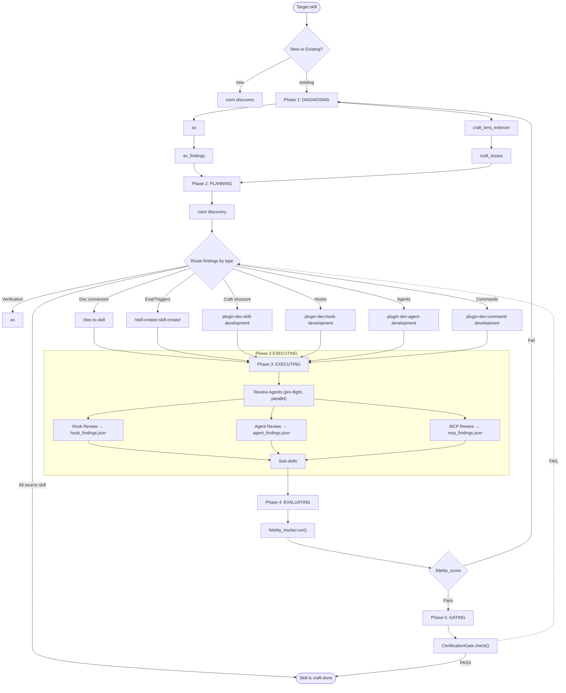

# skill-craft — Unified Skill-Craft Orchestrator

Coordinates skill improvement through a 5-phase pipeline: **diagnosing → planning → executing → evaluating → gating**.

## Mermaid Diagram Authoring

When creating documentation diagrams, produce mermaid that is **readable, minimal, and almost never has crossing lines**.

### Layout Rules

| Rule | Why | Enforce with |
|------|-----|--------------|
| **Direction matters** | TD (top-down) keeps phases vertical; LR (left-right) is good for state machines | `flowchart TD` or `flowchart LR` |
| **Group by phase** | Nodes that share a conceptual phase should share a rank (same vertical column) | Order nodes so related nodes appear on the same rank |
| **Avoid crossing edges** | Crossing lines create cognitive load and obscure the actual flow | If lines cross, swap node order or insert invisible `style` nodes |
| **Color-code edge types** | Different colors for pass/fail/loop-back paths let the reader scan intent instantly | Use `stroke` colors on edges or linkStyle; map consistent colors to consistent semantics |
| **Curve: basis or monotone** | `curve: 'basis'` gives smooth bezier curves; sharp corners signal a layout problem | `flowchart TD with curve: 'basis'` |
| **Padding and spacing** | Nodes too close together fuse visually; too far and the eye loses the thread | `nodeSpacing`, `rankSpacing`, `padding` in flowchart config |
| **Max width** | Wrapped text inside nodes creates Jagged edges; let nodes be as wide as they need | `useMaxWidth: true` on the container; no fixed width on svg |

### Node Shape Choices

- **Start/End nodes**: `(["label"])` — rounded pill, signals terminal state
- **Phase headers**: `["Phase 1: DIAGNOSING"]` — plain, just a label
- **Sub-skill nodes**: `"sub-skill-name"` — plain text, no decoration
- **Conditional nodes**: `{label}` — diamond, signals a decision or branch
- **Data/state nodes**: `[["data label"]]` — rectangle with built-in line break

### Edge Semantics (use consistently)

| Edge type | Color | Stroke width | Meaning |
|-----------|-------|--------------|---------|
| Forward/pass | green | 2px | Happy path, next phase |
| Back/loop | red | 2px | Loop-back, failure path |
| Delegation | purple | 1.5px | Sub-skill invocation |
| Data flow | cyan | 1px | Data passing between phases |

### Color Palette (dark + light)

```javascript
dark:  { success: '#4ade80', fallback: '#f87171', discovery: '#c084fc', entry: '#60a5fa', analysis: '#22d3ee', other: '#71717a' }
light: { success: '#16a34a', fallback: '#dc2626', discovery: '#7c3aed', entry: '#2563eb', analysis: '#0891b2', other: '#6b7280' }
```

### Diagram Checklist (before saving)

1. Can you trace from Start to End without lifting your pen?
2. Do any two edges cross?
3. Is every node labeled clearly enough to stand alone without the surrounding text?
4. Does every non-forward edge have a labeled condition?
5. Is the diagram readable at 50% zoom?

### Example: Minimal Crossing Flow



Key layout decisions:
- **New vs. Existing branch** — `Start` splits on "new" (→ USM, skip DIAGNOSING) vs "existing" (→ DIAGNOSING then USM). New skills skip the validator phase.
- **`/usm` inside Phase 2** — capability discovery runs before routing
- **Review Agents in a subgraph** — explicit two-step structure (pre-flight → sub-skills)
- **`[placeholder]` nodes** for unimplemented sub-skills — signals where future skills are planned
- **CertGate FAIL edge is dashed** — cross-diagram routing indicated visually

## 5-Phase Pipeline

### Phase 1: DIAGNOSING

Run two validators in parallel:

1. **`av`** — verification, validation, correctness checking
2. **`craft_lens_enforcer`** — imperative form check, third-person trigger check, SKILL.md body line count, progressive disclosure verification

### Phase 2: PLANNING

Capability discovery via `/usm` runs first, before routing:

**`/usm` Capability Discovery**
Before routing findings, run `/usm` to search for existing skills, plugins, agents, hooks, and MCPS that could add value to the target skill:

```
/usm search "<skill-name>" --category all
```

Look for:
- **Skills**: Does a skill already exist that covers part of this problem?
- **Plugins**: Is there a plugin that extends the skill's capabilities?
- **Agents**: Could a sub-agent handle a distinct phase better?
- **Hooks**: Would a hook improve enforcement or feedback?
- **MCPS**: Is there an MCP server that provides relevant tools?

If `/usm` finds a match, route to it instead of rebuilding. Exit immediately if all findings are owned by the **source skill** (nothing to do).

**Routing Table**

Route findings to the correct sub-skill by type:

| Finding type | Sub-skill | Description |
|-------------|-----------|-------------|
| Verification/Correctness | `av` | Validate skill structure, output correctness |
| Documentation conversion | `/doc-to-skill` | Convert existing docs into skill structure |
| Eval iteration | `/skill-creator:skill-creator` | Trigger optimization, description improvement |
| Craft structure | [placeholder] | Progressive disclosure, SKILL.md lean |
| Hook integration | [placeholder] | Add or improve hooks |
| Agent definition | [placeholder] | Define agents within ecosystem |
| Slash commands | [placeholder] | Create new slash commands |

**Note:** `[placeholder]` sub-skills are planned but not yet built. Until then, invoke the parent skill-craft orchestrator directly or delegate to an agent.

Exit immediately if all findings are owned by the **source skill** (nothing to do).

### Phase 3: EXECUTING

Invoke sub-skills by priority order: `ship → creator → development → audit`

### Phase 4: EVALUATING

Run `fidelity_tracker.run()`:
- **Trigger accuracy**: % of expected triggers that fired
- **Outcome accuracy**: % of outputs matching expected patterns
- **Degradation delta**: fidelity change vs last baseline

If fidelity_score fails → loop back to Phase 1 with updated state.

### Phase 5: GATING

Run `CertificationGate.check()`:
- `validate_context_size()` — SKILL.md body <500 lines
- `name + description present` — required frontmatter
- `description triggers match usage` — no hallucinated flags

If cert gate fails → route to repair sub-skill. Exit only when **both** fidelity_score AND cert gate pass.

## Sub-loops (Phase 2)

Delegate repetitive sub-loops to `/tilldone`:
- "Run eval until all queries pass or max 5 iterations"
- "Run audit until no HIGH findings remain or max 3 passes"

This keeps skill-craft as an orchestrator, not a loop controller.

## Self-Verifying Skills

A **self-verifying skill** is one that can assess whether it is progressing correctly through its own workflow — not just whether it ran, but whether the output at each phase is actually correct.

This is distinct from skill review (another agent looking at your skill) or testing (pre-deployment validation). Self-verification is a **runtime control loop**: the skill checks its own outputs as it runs and decides whether to continue, loop back, or abort.

### Three patterns exist in the ecosystem

| Pattern | What it does | Where it lives |
|--------|--------------|----------------|
| **Self-Verify Loop** | PostToolUse hook returns `{"ok": bool, "reason": str}` — if `!ok`, re-injects corrected input | Hook frontmatter (`claude-hooks-v3.1.md` §6.1) |
| **Fidelity Tracking** | Each phase emits a structured checkpoint; eval set scores trigger accuracy, outcome accuracy, degradation delta | Phase 4 of this skill |
| **Lifecycle Evaluation** | Pre-deployment eval against test cases + production telemetry comparing actual to expected | `eval_sets/default.json` + production monitoring |

skill-craft implements **fidelity tracking** in Phase 4 and **lifecycle evaluation** in Phase 5. The Self-Verify Loop pattern lives in hook frontmatter and is complementary.

### Skill Self-Verification in skill-craft

skill-craft references two components that implement the self-verification interface:

**`fidelity_tracker.run()`** — Phase 4 (EVALUATING)
- Reads `eval_sets/default.json` for the target skill
- Runs each eval case and produces a `fidelity_score`
- Scores: trigger accuracy (% of expected triggers that fired), outcome accuracy (% of outputs matching expected patterns), degradation delta (fidelity change vs last baseline)
- If `fidelity_score` fails → loop back to Phase 1 with updated state

**`CertificationGate.check()`** — Phase 5 (GATING)
- Validates the target skill's SKILL.md at rest
- Checks: `validate_context_size()` (SKILL.md body <500 lines), `name + description present` (required frontmatter), `description triggers match usage` (no hallucinated flags)
- If cert gate fails → route to repair sub-skill
- Exit only when **both** fidelity_score AND cert gate pass

Both are implemented as standalone scripts in `__lib/`:

```bash
python __lib/run_cert_gate.py <skill_path>   # Phase 5 gate
python __lib/run_fidelity.py <skill_path>    # Phase 4 fidelity
```

### External ecosystem references

When building self-verification for a skill, these external tools and patterns inform implementation:

- **Anthropic eval guidance** — trigger accuracy + outcome accuracy as core metrics
- **LangChain Agent Observatory** — trace-based phase checkpointing
- **AWS agent observability patterns** — runtime telemetry + pre-deployment eval pairing
- **DeepEval / Braintrust** — golden dataset comparison for outcome accuracy
- **Azure AI Agent observability** — lifecycle evaluation (pre-deployment through production)

### Anti-patterns

1. **Verification-only skills** — A skill that checks its own output but has no mechanism to act on failures (no loop-back, no escalation). Self-verification without self-correction is just auditing.

2. **Fidelity theater** — Running an eval set and declaring success without the implementation to close the loop. The fidelity score must drive behavior.

3. **Hallucinated triggers** — Listing triggers in SKILL.md frontmatter that the skill never actually responds to. This fails CertificationGate's `description triggers match usage` check.

## Review Agents

Three specialist agents run **in parallel** as pre-flight checks before sub-skills during Phase 3 (EXECUTING). Spawn them when the skill is non-trivial.

### 1. Hook Review Agent

```
purpose: Review skill for optimal hook integration — determines where and how the skill could use or benefit from hooks, and how it integrates with the global hook environment
inputs:
  - plugin-dev:hook-development  # Live hook development standard (updated with plugin)
  - P:/.claude/docs/claude-hooks-v3.1.md  # Hook architecture, hierarchy, enforcement patterns
  - target_skill_path                       # The skill being reviewed (SKILL.md + any code)
checks:
  - Read the target skill's SKILL.md fully before assessing
  - Does the skill benefit from pre-tool or post-tool hooks?
  - Are there enforcement gaps a hook could close?
  - Would a blocking hook improve behavior more than advisory?
  - Are there existing hooks this skill should chain with?
  - Could /hook-obs help identify patterns in how this skill's hooks are performing?
  - Does this skill introduce new hook patterns that need to be registered globally?
  - Should this skill's hook needs be met by plugin-dev:hook-development?
output: hook_findings.json — array of {hook_type, location, recommendation, priority, integration_point}
```

**Invoke**: When the skill has conditional enforcement, state dependencies, or repeated validation patterns.

**Hook Reference**: The canonical hooks doc is at `P:/.claude/docs/claude-hooks-v3.1.md`. Key sections for the review agent:
- Hook types and hierarchy (PreToolUse, PostToolUse, StopHook, etc.)
- Blocking vs advisory enforcement patterns
- Hook chaining and composition
- Permission models and registration

**Companion skills for hook review:**
- `/hook-obs` — check hook performance, block patterns, and compliance before recommending new hooks
- `plugin-dev:hook-development` — use when a new hook needs to be built, not just registered
- `/hooks-edit` — use when editing existing global hooks or adding new registrations

**Hook integration decision tree:**
1. Can an existing global hook handle this? → check `/hook-obs` for patterns
2. Does a new hook need to be built? → invoke `plugin-dev:hook-development`
3. Should the skill own its own hooks (skill-private)? → register in skill's own hooks/ dir
4. Should the hook be global (affects all skills)? → add to global hook registry

### 2. Agent Review Agent

```
purpose: Review skill for optimal sub-agent and MCP use
agent: mcp-agent-analyzer
inputs:
  - P:/.claude/docs/claude-agents-v1.0.md  # Agent patterns, team architecture, best practices reference
  - P:/.claude/docs/claude-mcp-v1.0.md     # MCP integration, skill composition, security reference
  - plugin-dev:agent-development            # Live agent development standard (updated with plugin)
  - plugin-dev:mcp-integration              # Live MCP integration guide (updated with plugin)
  - target_skill_path                       # The skill being reviewed (SKILL.md + any code)
checks:
  - Could a sub-agent handle a distinct phase better than the skill itself?
  - Are there parallel workstreams that would benefit from concurrent agents?
  - Would spawning an agent reduce context burden vs staying in-skill?
  - Are there existing agents this skill should delegate to?
  - Does this skill have gaps vs claude-agents-v1.0.md best practices?
  - Would fan-out, spec/impl separation, or token budgeting improve this skill?
  - What MCP servers could this skill use? Are tool descriptions generic or specific?
  - Are there skill composition or chaining opportunities?
  - Does this skill exhibit any MCP anti-patterns (tool poisoning risk, prompt injection vectors)?
output: agent_findings.json — array of {agent_type, task_phase, recommendation, priority}
```

**Invoke**: When the skill has multiple independent phases, complex parallel workstreams, or tasks that benefit from different expertise domains.

### 3. MCP Review Agent

```
purpose: Review skill for optimal MCP tool use
inputs:
  - plugin-dev:mcp-integration  # Live MCP integration guide (updated with plugin)
  - target_skill_path           # The skill being reviewed (SKILL.md + any code)
checks:
  - Does the skill's domain have a relevant MCP server?
  - Would an MCP tool replace a fragile or slow subprocess call?
  - Is there a Browser Use, Brave Search, or Perplexity MCP that fits?
  - Could an MCP backend (CHS, CKS, CDS) provide knowledge or context?
  - Does the skill follow MCP integration best practices from the live plugin-dev guide?
  - Are MCP tool descriptions specific (not generic)?
output: mcp_findings.json — array of {mcp_name, capability, integration_point, recommendation, priority}
```

**Invoke**: When the skill interacts with external services, does research, searches codebases, or uses web tools.

### 4. Skill Implementation Review Agent

```
purpose: Review skill for runtime quality — artifact isolation, error handling, execution compliance
agent: skill-reviewer
inputs:
  - P:/.claude/docs/claude-skill-v1.0.md  # Skill authoring standard (terminal_id, artifact isolation)
  - plugin-dev:skill-development           # Live skill development guide (updated with plugin)
  - target_skill_path                       # The skill being reviewed (SKILL.md + any code)
checks:
  - Does the skill write runtime artifacts to .claude/.artifacts/{terminal_id}/{skill_name}/?
  - Are there hardcoded paths instead of terminal_id-resolved paths?
  - Does the skill check exit codes on external commands?
  - Does the skill set timeouts on long-running operations?
  - Does the skill report errors with actionable guidance, or silently swallow them?
  - Does the skill use the Skill tool correctly, or substitute tool execution with prose analysis?
  - Are agent invocations using subagent_type strings that actually exist in the plugin cache or `.claude/agents/`? (verify against runtime discovery)
  - Does the skill handle sub-skill/agent failures gracefully?
output: runtime_findings.json — array of {category, severity, issue, location, fix}
```

**Invoke**: When a skill has passed definition review (plugin-dev:skill-reviewer) and needs production-readiness validation. Runs after definition review, not instead of it. A skill with perfect SKILL.md but broken runtime should fail this review.

### Agent Review Workflow

Phase 3 runs in two steps:

**Step 1 — Review Agents (pre-flight, parallel):**
```
Phase 3 (EXECUTING)
  ├── Hook Review Agent           → hook_findings.json
  ├── Agent Review Agent         → agent_findings.json
  ├── MCP Review Agent            → mcp_findings.json
  └── Skill Implementation Review → runtime_findings.json
```

**Step 2 — Sub-skills (after pre-flight):**
```
invoke routed sub-skills per planning results (av, /doc-to-skill, /skill-creator, etc.)
```

All findings from both validators and review agents route back to Phase 2 (PLANNING) for incorporation into the next planning cycle.

Each agent outputs a JSON artifact. If findings exist, route them to the appropriate sub-skill for repair or integration. If no findings, note "no agent-specific gaps found" and continue.

## HTML Artifact Authoring

When skill-craft generates or rewrites an `index.html` page for a skill, apply these rules to avoid the common breakage patterns.

### CSS Rules

| Rule | Why |
|------|-----|
| **No duplicate selectors** | A second `.mermaid-container {}` rule overwrites the first. Merge all properties into one rule. |
| **`line-height: 0` on container** | Prevents unwanted vertical space below the SVG. Always pair with `overflow-x: auto`. |
| **`max-width: 100%; height: auto` on SVG** | Makes diagram responsive. Never set fixed pixel width on the SVG itself. |

### HTML Structure

```
.diagram-wrapper          ← position: relative; overflow: hidden
  ├── .mermaid-container ← line-height: 0; contains <pre class="mermaid">
  └── .zoom-controls      ← position: absolute; bottom/right inside .diagram-wrapper
```

**Critical: `.zoom-controls` must be a sibling of `.mermaid-container`, not a child.**

Reason: `setTheme()` (and any similar JS that replaces `container.innerHTML`) destroys all descendants. If `.zoom-controls` is inside `.mermaid-container`, the zoom buttons vanish on theme toggle.

### Mermaid CDN

Use the CDN import for ESM bundles — never a local copy:

```html
<script type="module">
  import mermaid from 'https://cdn.jsdelivr.net/npm/mermaid@11/dist/mermaid.esm.min.mjs';
</script>
```

Local ESM bundles fail because the mermaid ESM file references code-splitting chunks (e.g. `chunk-267PNR3T.mjs`) that cannot be downloaded independently. The CDN serves the full bundled version correctly.

### TOC Toggle

Attach the click listener via `addEventListener` inside a `DOMContentLoaded` handler — **never inline `onclick`**:

```javascript
window.addEventListener('DOMContentLoaded', () => {
  const btn = document.getElementById('tocToggle');
  const toc  = document.getElementById('toc');
  if (btn && toc) {
    btn.addEventListener('click', () => {
      toc.classList.toggle('collapsed');
      document.body.classList.toggle('toc-hidden');
    });
  }
});
```

Inline `onclick="..."` combined with a DOMContentLoaded listener causes **double-fire**: both fire on the same click, toggling twice → no net state change.

### DOMContentLoaded Timing with Module Scripts

`<script type="module">` is always deferred — it runs **after** `DOMContentLoaded` fires. This means code that registers event listeners inside `window.addEventListener('DOMContentLoaded', ...)` runs before the module script executes. If your TOC init depends on module code having already run, move it after the module import or use a different ready signal.

### Testing

- **Click testing**: Use native `.click()` in test harnesses — `js("el.click()")` via CDP harness may not dispatch events the same way as a real browser click.
- **Visual verification**: Take screenshots rather than relying on DOM query results when validating that diagrams rendered or toggles worked.

## Sub-skill Recommendations

When a finding type maps to a known sub-skill, invoke it directly. Also proactively recommend these when they add value:

| Sub-skill | When to invoke |
|-----------|----------------|
| `/skill-creator:skill-creator` | Eval iteration, trigger optimization, description improvement |
| `plugin-dev:skill-development` | Progressive disclosure, SKILL.md structure, craft conventions |
| `/doc-to-skill` | Converting existing docs into a skill structure |
| `plugin-dev:hook-development` | Adding or improving hooks for the skill |
| `plugin-dev:agent-development` | Defining agents within the skill ecosystem |
| `plugin-dev:command-development` | Creating new slash commands for the skill |
| `av` | Verification, validation, or correctness checking |
