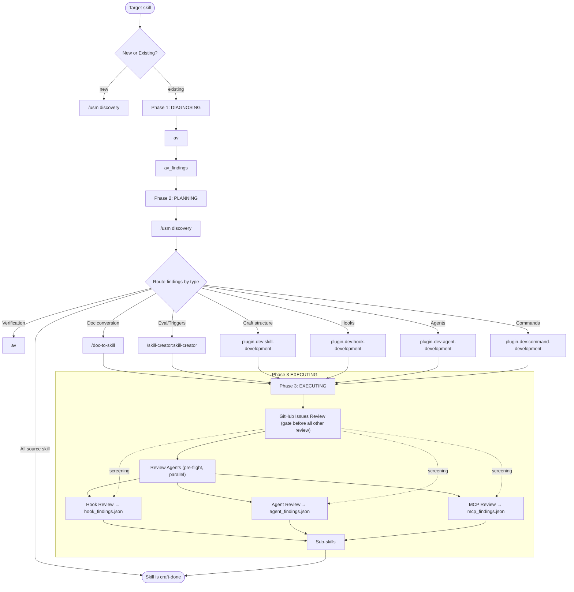

# skill-craft — Unified Skill-Craft Orchestrator

Coordinates skill improvement through a 5-phase pipeline: **diagnosing → planning → executing → evaluating → gating**.

## Mermaid Diagram Authoring

When creating documentation diagrams, produce mermaid that is **readable, minimal, and almost never has crossing lines**.

### Layout Rules

| Rule | Why | Enforce with |
|------|-----|--------------|
| **Direction matters** | TD (top-down) keeps phases vertical; LR (left-right) is good for state machines | `flowchart TD` or `flowchart LR` |
| **Group by phase** | Nodes that share a conceptual phase should share a rank (same vertical column) | Order nodes so related nodes appear on the same rank |
| **Avoid crossing edges** | Crossing lines create cognitive load and obscure the actual flow | If lines cross, swap node order or insert invisible `style` nodes |
| **Color-code edge types** | Different colors for pass/fail/loop-back paths let the reader scan intent instantly | Use `stroke` colors on edges or linkStyle; map consistent colors to consistent semantics |
| **Curve: basis or monotone** | `curve: 'basis'` gives smooth bezier curves; sharp corners signal a layout problem | `flowchart TD with curve: 'basis'` |
| **Padding and spacing** | Nodes too close together fuse visually; too far and the eye loses the thread | `nodeSpacing`, `rankSpacing`, `padding` in flowchart config |
| **Max width** | Wrapped text inside nodes creates Jagged edges; let nodes be as wide as they need | `useMaxWidth: true` on the container; no fixed width on svg |

### Node Shape Choices

- **Start/End nodes**: `(["label"])` — rounded pill, signals terminal state
- **Phase headers**: `["Phase 1: DIAGNOSING"]` — plain, just a label
- **Sub-skill nodes**: `"sub-skill-name"` — plain text, no decoration
- **Conditional nodes**: `{label}` — diamond, signals a decision or branch
- **Data/state nodes**: `[["data label"]]` — rectangle with built-in line break

### Edge Semantics (use consistently)

| Edge type | Color | Stroke width | Meaning |
|-----------|-------|--------------|---------|
| Forward/pass | green | 2px | Happy path, next phase |
| Back/loop | red | 2px | Loop-back, failure path |
| Delegation | purple | 1.5px | Sub-skill invocation |
| Data flow | cyan | 1px | Data passing between phases |

### Color Palette (dark + light)

```javascript
dark:  { success: '#4ade80', fallback: '#f87171', discovery: '#c084fc', entry: '#60a5fa', analysis: '#22d3ee', other: '#71717a' }
light: { success: '#16a34a', fallback: '#dc2626', discovery: '#7c3aed', entry: '#2563eb', analysis: '#0891b2', other: '#6b7280' }
```

### Diagram Checklist (before saving)

1. Can you trace from Start to End without lifting your pen?
2. Do any two edges cross?
3. Is every node labeled clearly enough to stand alone without the surrounding text?
4. Does every non-forward edge have a labeled condition?
5. Is the diagram readable at 50% zoom?

### Mermaid Critic (inline agent)

Every generated mermaid diagram must be reviewed before saving using an inline agent with no dedicated file. Spawn with full instructions inline:

```
agent: general-purpose
purpose: Validate mermaid diagrams for clarity, readability, and layout quality
prompt: |
  Review the following mermaid diagram:
  [inject diagram source]
  Check all of:
  1. Trace Start-to-End without lifting your pen
  2. Count edge crossings (flag if > 0)
  3. Verify all node labels are self-explanatory
  4. Verify every non-forward edge has a labeled condition
  5. Check diagram readability at 50% zoom
  6. Check for syntax errors
  Report: { crossings: int, syntax_errors: [], legibility_score: float, issues: [] }
  Gate: crossings == 0 AND syntax_errors == [] AND legibility_score >= 0.8
gate: crossings == 0 AND syntax_errors == [] AND legibility_score >= 0.8
```

If the critic fails, fix the diagram before saving. Common fixes:
- Reorder nodes to eliminate crossings
- Insert invisible nodes to force rank alignment
- Use `rank` directives to group related nodes
- Shorten long labels

**No dedicated agent file needed** — criteria are stable and fit inline. Extract to a reference file only if the prompt grows beyond ~15 lines.

### Reset Button (HTML diagrams)

Every HTML skill page with a mermaid diagram must include a **reset button** to restore zoom/pan to default. Mandatory in all skill index.html files.

```html
<div class="zoom-controls">
  <button class="zoom-btn" id="zoomIn" title="Zoom in">+</button>
  <button class="zoom-btn" id="zoomOut" title="Zoom out">−</button>
  <button class="zoom-btn zoom-reset" id="zoomReset" title="Reset">1:1</button>
</div>
```

### Example: Minimal Crossing Flow



Key layout decisions:
- **New vs. Existing branch** — `Start` splits on "new" (→ USM, skip DIAGNOSING) vs "existing" (→ DIAGNOSING then USM). New skills skip the validator phase.
- **`/usm` inside Phase 2** — capability discovery runs before routing
- **Review Agents in a subgraph** — explicit two-step structure (pre-flight → sub-skills)
- **`[placeholder]` nodes`** for unimplemented sub-skills — signals where future skills are planned

## 3-Phase Pipeline

### Phase 1: DIAGNOSING

Run validation via `av`. When `av` is unavailable, perform direct analysis:
- Imperative form check (all directives in present tense)
- Third-person trigger check (no bare "trigger" without explicit subject)
- SKILL.md body line count verification
- Progressive disclosure verification

### Phase 2: PLANNING

Capability discovery via `/usm` runs first, before routing:

**`/usm` Capability Discovery**
Before routing findings, run `/usm` to search for existing skills, plugins, agents, hooks, and MCPS that could add value to the target skill:

```
/usm search "<skill-name>" --category all
```

Look for:
- **Skills**: Does a skill already exist that covers part of this problem?
- **Plugins**: Is there a plugin that extends the skill's capabilities?
- **Agents**: Could a sub-agent handle a distinct phase better?
- **Hooks**: Would a hook improve enforcement or feedback?
- **MCPS**: Is there an MCP server that provides relevant tools?

If `/usm` finds a match, route to it instead of rebuilding. Exit immediately if all findings are owned by the **source skill** (nothing to do).

**Routing Table**

Route findings to the correct sub-skill by type:

| Finding type | Sub-skill | Description |
|-------------|-----------|-------------|
| Verification/Correctness | `av` | Validate skill structure, output correctness |
| Documentation conversion | `/doc-to-skill` | Convert existing docs into skill structure |
| Eval iteration | `/skill-creator:skill-creator` | Trigger optimization, description improvement |
| Craft structure | [placeholder] | Progressive disclosure, SKILL.md lean |
| Hook integration | [placeholder] | Add or improve hooks |
| Agent definition | [placeholder] | Define agents within ecosystem |
| Slash commands | [placeholder] | Create new slash commands |

**Note:** `[placeholder]` sub-skills are planned but not yet built. Until then, invoke the parent skill-craft orchestrator directly or delegate to an agent.

Exit immediately if all findings are owned by the **source skill** (nothing to do).

### Phase 3: EXECUTING

Invoke sub-skills by priority order: `ship → creator → development → audit`

## Sub-loops

Delegate repetitive sub-loops via the evaluating phase:
- "Run eval until all queries pass or max 5 iterations"
- "Run audit until no HIGH findings remain or max 3 passes"

This keeps skill-craft as an orchestrator, not a loop controller. Iterative evaluation is driven by Phase 4 (EVALUATING) fidelity gates, not an external loop skill.

## Review Agents

Four specialist agents run **in parallel** as pre-flight checks before sub-skills during Phase 3 (EXECUTING). Spawn them when the skill is non-trivial.

### 0. GitHub Issues Review Agent (Pre-flight)

```
purpose: Check GitHub issues for known breakages AND new features/best practices; write separate per-recipient files so each downstream agent only reads what matters to it
agent: general-purpose
inputs:
  - GH_CLI or gh command available
  - target_component_identifier     # skill name, hook name, agent name, or MCP server name under review
  - claude-code GitHub repo        # Anthropic's official repo for issues
artifacts:
  - Base path: .claude/.artifacts/{terminal_id}/skill-craft/github-review/
  - Write FOUR separate files — each downstream agent reads only its own:
      hook_issues.json       # Hook Review Agent
      agent_issues.json      # Agent Review Agent
      mcp_issues.json        # MCP Review Agent
      runtime_issues.json    # Skill Implementation Review Agent
  - Each file contains two sections:
      blocked:    array of {component, issue_number, issue_title, severity, reason}
      opportunities: array of {component, issue_number, issue_title, relevance, recommendation}
  - Include ANY finding that might be relevant to the recipient — cast wide, not narrow.
    "Might be relevant" threshold: the issue mentions the component type, a related keyword,
    or a behavior the recipient agent checks — even if the agent might ultimately decide it's not applicable.
    Over-include rather than under-include at write-time; filtering is the recipient's job.
checks:
  PART A — BLOCKING (known breakages):
  - Run: gh issue list --repo anthropics/claude-code --state open --label <component_type> 2>/dev/null
    OR: gh issue list --repo anthropics/claude-code --search "<component_name> bug broken" --state open
  - Parse for: "broken", "bug", "doesn't work", "fails", "invalid" in title; 50+ reactions; component-label matches
  - Flag blocked components in the appropriate per-recipient file

  PART B — OPPORTUNITIES (new features and best practices):
  - Run: gh issue list --repo anthropics/claude-code --state open --label <component_type> --since 2025-01-01 2>/dev/null
    OR: gh issue list --repo anthropics/claude-code --search "<component_name> feature" --state open
  - Look for: "enhancement", "feature-request" labels; 20+ reactions; recent issues (last 6 months);
    resolutions indicating new recommended approaches
  - Write each opportunity to ALL relevant per-recipient files (cast wide — let recipients filter)

  **Cross-recipient rules** (use BOTH files when a finding touches multiple agent domains):

  | Finding type | Files to write |
  |-------------|---------------|
  | MCP timeout/connectivity | `mcp_issues.json` + `runtime_issues.json` |
  | Hook pattern for agent suggestion | `hook_issues.json` + `agent_issues.json` |
  | Agent registration via hooks | `hook_issues.json` + `agent_issues.json` |
  | Skill loading performance | `runtime_issues.json` + `agent_issues.json` |
  | PreToolUse matcher enhancement | `hook_issues.json` + `mcp_issues.json` |
  | Stop hook command registration | `hook_issues.json` + `runtime_issues.json` |
  | MCP server authentication | `mcp_issues.json` + `runtime_issues.json` |
  | General feature/best-practice (uncertain recipient) | ALL FOUR files |

  **Decision rule**: When unsure which files to write to, include the finding in ALL files that might conceivably care about it. Over-include at write-time; filter at read-time. The cost of a recipient reading one extra item is lower than the cost of a missed blocking issue.

  **Example walkthroughs**:
  - "Issue #41203: PreToolUse matcher supports regex groups" → PreToolUse matcher is a hook feature AND an agent capability → write to `hook_issues.json` + `agent_issues.json`
  - "Issue #39871: MCP server reconnect drops auth headers" → MCP connectivity + auth → write to `mcp_issues.json` + `runtime_issues.json`
  - "Issue #40511: Stop hooks can now return structured data" → Stop hooks are runtime AND agent-facing → write to `hook_issues.json` + `agent_issues.json` + `runtime_issues.json`
  - "Issue #41488: New `claude models list` command" → General CLI feature, unclear which agent → write to ALL FOUR files
```

**Output files** (written to `.claude/.artifacts/{terminal_id}/skill-craft/github-review/`):

| File | Recipients | Content |
|------|-----------|---------|
| `hook_issues.json` | Hook Review Agent | Hook-type issues + any hook-adjacent findings |
| `agent_issues.json` | Agent Review Agent | Agent/MCP-type issues + agent-adjacent findings |
| `mcp_issues.json` | MCP Review Agent | MCP-type issues + MCP-adjacent findings |
| `runtime_issues.json` | Skill Implementation Review | Runtime/execution issues + runtime-adjacent findings |

**Multi-terminal safety**: All paths scoped to `{terminal_id}` — concurrent sessions do not overwrite each other.

**Workflow integration**: Downstream agents read only their own file. They do NOT receive the full `issues_findings.json`. This removes the need for prompt-based filtering — the contract is structural (separate files), not advisory (prompt instruction). Each agent's prompt simply tells it which file to read.

**Example file** (`hook_issues.json`):
```json
{
  "blocked": [
    {
      "component": "type:prompt Stop hooks",
      "issue_number": 37559,
      "issue_title": "Hook evaluator API error: API Error: 400 invalid_request_error",
      "severity": "block",
      "reason": "Broken at platform level across v2.1.81–v2.1.117"
    }
  ],
  "opportunities": [
    {
      "component": "PreToolUse hook registration",
      "issue_number": 41023,
      "issue_title": "Add named hook registration support",
      "relevance": "high",
      "recommendation": "New skills should use named hook registration instead of matcher-only"
    }
  ]
}
```

**Invoke**: FIRST, before any review agents run.

**Invoke**: FIRST, before any review agents run. Prevents recommending a component with known breakages.

**GitHub Issue Severity Heuristics**:
- **Block recommendation**: Issue title contains "broken", "doesn't work", "invalid params", "API error 400", or issue has 50+ reactions
- **Warn and recommend**: Issue is a minor inconvenience or cosmetic, low reactions
- **Proceed normally**: No relevant open issues found

**Why this runs first**: A review agent might recommend `plugin-dev:agent-development` or `some-mcp-server`, but if that component has open issues describing it as broken, recommending it wastes the user's time and erodes trust in the skill-craft pipeline.

**Example**:
```json
{
  "component": "type: prompt Stop hooks",
  "component_type": "hook",
  "issue_number": 37559,
  "issue_title": "Hook evaluator API error: API Error: 400 invalid_request_error",
  "severity": "block",
  "recommendation_blocked": true,
  "recommendation": "Do NOT recommend Stop hooks with type:prompt — broken at platform level (v2.1.81 through v2.1.117)"
}
```

**Workflow integration**: After running this agent, filter findings so blocked components never appear in recommendations. Route around broken components if alternatives exist.

### 1. Hook Review Agent

```
purpose: Review skill for optimal hook integration — determines where and how the skill could use or benefit from hooks, and how it integrates with the global hook environment
inputs:
  - plugin-dev:hook-development  # Live hook development standard (updated with plugin)
  - P:/.claude/docs/claude-hooks-v3.1.md  # Hook architecture, hierarchy, enforcement patterns
  - target_skill_path                       # The skill being reviewed (SKILL.md + any code)
  - .claude/.artifacts/{terminal_id}/skill-craft/github-review/hook_issues.json
checks:
  - Read hook_issues.json FIRST — contains blocked components and opportunities specific to hooks
  - For each blocked entry: note the issue number and recommend an alternative approach
  - For each opportunity: evaluate whether it applies to this skill's hook usage
  - Does the skill benefit from pre-tool or post-tool hooks?
  - Are there enforcement gaps a hook could close?
  - Would a blocking hook improve behavior more than advisory?
  - Are there existing hooks this skill should chain with?
  - Could /hook-obs help identify patterns in how this skill's hooks are performing?
  - Does this skill introduce new hook patterns that need to be registered globally?
  - Should this skill's hook needs be met by plugin-dev:hook-development?
output: hook_findings.json — array of {hook_type, location, recommendation, priority, integration_point}
```

**Invoke**: When the skill has conditional enforcement, state dependencies, or repeated validation patterns.

**Hook Reference**: The canonical hooks doc is at `P:/.claude/docs/claude-hooks-v3.1.md`. Key sections for the review agent:
- Hook types and hierarchy (PreToolUse, PostToolUse, StopHook, etc.)
- Blocking vs advisory enforcement patterns
- Hook chaining and composition
- Permission models and registration

**Blocking stderr standard (REQUIRED):** All PreToolUse hooks that exit code 2 MUST print a descriptive error to stderr explaining WHY the action was blocked. Claude Code shows "Blocked by hook" — the stderr text is the only explanation. Pattern:
```python
print(f"⛔ BLOCKED: '{tool_name}' not allowed because {reason}", file=sys.stderr)
sys.exit(2)
```
Review should flag any blocking hook with non-descriptive or missing stderr output.

**Companion skills for hook review:**
- `/hook-obs` — check hook performance, block patterns, and compliance before recommending new hooks
- `plugin-dev:hook-development` — use when a new hook needs to be built, not just registered
- `/hooks-edit` — use when editing existing global hooks or adding new registrations

**Hook integration decision tree:**
1. Can an existing global hook handle this? → check `/hook-obs` for patterns
2. Does a new hook need to be built? → invoke `plugin-dev:hook-development`
3. Should the skill own its own hooks (skill-private)? → register in skill's own hooks/ dir
4. Should the hook be global (affects all skills)? → add to global hook registry

### 2. Agent Review Agent

```
purpose: Review skill for optimal sub-agent and MCP use
agent: mcp-agent-analyzer
inputs:
  - P:/.claude/docs/claude-agents-v1.0.md  # Agent patterns, team architecture, best practices reference
  - P:/.claude/docs/claude-mcp-v1.0.md     # MCP integration, skill composition, security reference
  - plugin-dev:agent-development            # Live agent development standard (updated with plugin)
  - plugin-dev:mcp-integration              # Live MCP integration guide (updated with plugin)
  - target_skill_path                       # The skill being reviewed (SKILL.md + any code)
  - .claude/.artifacts/{terminal_id}/skill-craft/github-review/agent_issues.json
checks:
  - Read agent_issues.json FIRST — contains blocked components and opportunities for agents and MCPs
  - For each blocked entry: note the issue number and recommend an alternative agent/server
  - For each opportunity: evaluate whether the enhancement or best practice applies to this skill
  - Are there parallel workstreams that would benefit from concurrent agents?
  - Would spawning an agent reduce context burden vs staying in-skill?
  - Are there existing agents this skill should delegate to?
  - Does this skill have gaps vs claude-agents-v1.0.md best practices?
  - Would fan-out, spec/impl separation, or token budgeting improve this skill?
  - What MCP servers could this skill use? Are tool descriptions generic or specific?
  - Are there skill composition or chaining opportunities?
  - Does this skill exhibit any MCP anti-patterns (tool poisoning risk, prompt injection vectors)?
output: agent_findings.json — array of {agent_type, task_phase, recommendation, priority}
```

**Invoke**: When the skill has multiple independent phases, complex parallel workstreams, or tasks that benefit from different expertise domains.

### 3. MCP Review Agent

```
purpose: Review skill for optimal MCP tool use
inputs:
  - plugin-dev:mcp-integration  # Live MCP integration guide (updated with plugin)
  - target_skill_path           # The skill being reviewed (SKILL.md + any code)
  - .claude/.artifacts/{terminal_id}/skill-craft/github-review/mcp_issues.json
checks:
  - Read mcp_issues.json FIRST — contains blocked MCP servers and new opportunities from GitHub
checks:
  - Does the skill's domain have a relevant MCP server?
  - Would an MCP tool replace a fragile or slow subprocess call?
  - Is there a Browser Use, Brave Search, or Perplexity MCP that fits?
  - Could an MCP backend (CHS, CKS, CDS) provide knowledge or context?
  - Does the skill follow MCP integration best practices from the live plugin-dev guide?
  - Are MCP tool descriptions specific (not generic)?
output: mcp_findings.json — array of {mcp_name, capability, integration_point, recommendation, priority}
```

**Invoke**: When the skill interacts with external services, does research, searches codebases, or uses web tools.

### 4. Skill Implementation Review Agent

```
purpose: Review skill for runtime quality — artifact isolation, error handling, execution compliance
agent: skill-reviewer
inputs:
  - P:/.claude/docs/claude-skill-v1.0.md  # Skill authoring standard (terminal_id, artifact isolation)
  - plugin-dev:skill-development           # Live skill development guide (updated with plugin)
  - target_skill_path                       # The skill being reviewed (SKILL.md + any code)
  - .claude/.artifacts/{terminal_id}/skill-craft/github-review/runtime_issues.json
checks:
  - Read runtime_issues.json FIRST — contains runtime/execution issues and opportunities from GitHub
checks:
  - Does the skill write runtime artifacts to .claude/.artifacts/{terminal_id}/{skill_name}/?
  - Are there hardcoded paths instead of terminal_id-resolved paths?
  - Does the skill check exit codes on external commands?
  - Does the skill set timeouts on long-running operations?
  - Does the skill report errors with actionable guidance, or silently swallow them?
  - Does the skill use the Skill tool correctly, or substitute tool execution with prose analysis?
  - Are agent invocations using subagent_type strings that actually exist in the plugin cache or `.claude/agents/`? (verify against runtime discovery)
  - Does the skill handle sub-skill/agent failures gracefully?
output: runtime_findings.json — array of {category, severity, issue, location, fix}
```

**Invoke**: When a skill has passed definition review (plugin-dev:skill-reviewer) and needs production-readiness validation. Runs after definition review, not instead of it. A skill with perfect SKILL.md but broken runtime should fail this review.

### Agent Review Workflow

Phase 3 runs in two steps:

**Step 1 — GitHub Issues Review (gate first, writes per-recipient files):**
```
Phase 3 (EXECUTING)
  └── GitHub Issues Review Agent
        ├── Write hook_issues.json      → Hook Review Agent
        ├── Write agent_issues.json    → Agent Review Agent
        ├── Write mcp_issues.json      → MCP Review Agent
        └── Write runtime_issues.json → Skill Implementation Review
```
Each downstream agent reads only its own file. Contract is structural, not prompt-based.

**Step 2 — Sub-skills (after pre-flight):**
```
invoke routed sub-skills per planning results (av, /doc-to-skill, /skill-creator, etc.)
```

All findings from both validators and review agents route back to Phase 2 (PLANNING) for incorporation into the next planning cycle.

Each agent outputs a JSON artifact. If findings exist, route them to the appropriate sub-skill for repair or integration. If no findings, note "no agent-specific gaps found" and continue.

## HTML Artifact Authoring

When skill-craft generates or rewrites an `index.html` page for a skill, apply these rules to avoid the common breakage patterns.

### CSS Rules

| Rule | Why |
|------|-----|
| **No duplicate selectors** | A second `.mermaid-container {}` rule overwrites the first. Merge all properties into one rule. |
| **`line-height: 0` on container** | Prevents unwanted vertical space below the SVG. Always pair with `overflow-x: auto`. |
| **`max-width: 100%; height: auto` on SVG** | Makes diagram responsive. Never set fixed pixel width on the SVG itself. |

### HTML Structure

```
.diagram-wrapper          ← position: relative; overflow: hidden
  ├── .mermaid-container ← line-height: 0; contains <pre class="mermaid">
  └── .zoom-controls      ← position: absolute; bottom/right inside .diagram-wrapper
```

**Critical: `.zoom-controls` must be a sibling of `.mermaid-container`, not a child.**

Reason: `setTheme()` (and any similar JS that replaces `container.innerHTML`) destroys all descendants. If `.zoom-controls` is inside `.mermaid-container`, the zoom buttons vanish on theme toggle.

### Mermaid CDN

Use the CDN import for ESM bundles — never a local copy:

```html
<script type="module">
  import mermaid from 'https://cdn.jsdelivr.net/npm/mermaid@11/dist/mermaid.esm.min.mjs';
</script>
```

Local ESM bundles fail because the mermaid ESM file references code-splitting chunks (e.g. `chunk-267PNR3T.mjs`) that cannot be downloaded independently. The CDN serves the full bundled version correctly.

### TOC Toggle

Attach the click listener via `addEventListener` inside a `DOMContentLoaded` handler — **never inline `onclick`**:

```javascript
window.addEventListener('DOMContentLoaded', () => {
  const btn = document.getElementById('tocToggle');
  const toc  = document.getElementById('toc');
  if (btn && toc) {
    btn.addEventListener('click', () => {
      toc.classList.toggle('collapsed');
      document.body.classList.toggle('toc-hidden');
    });
  }
});
```

Inline `onclick="..."` combined with a DOMContentLoaded listener causes **double-fire**: both fire on the same click, toggling twice → no net state change.

### DOMContentLoaded Timing with Module Scripts

`<script type="module">` is always deferred — it runs **after** `DOMContentLoaded` fires. This means code that registers event listeners inside `window.addEventListener('DOMContentLoaded', ...)` runs before the module script executes. If your TOC init depends on module code having already run, move it after the module import or use a different ready signal.

### Testing

- **Click testing**: Use native `.click()` in test harnesses — `js("el.click()")` via CDP harness may not dispatch events the same way as a real browser click.
- **Visual verification**: Take screenshots rather than relying on DOM query results when validating that diagrams rendered or toggles worked.

## Sub-skill Recommendations

When a finding type maps to a known sub-skill, invoke it directly. Also proactively recommend these when they add value:

| Sub-skill | When to invoke |
|-----------|----------------|
| `/skill-creator:skill-creator` | Eval iteration, trigger optimization, description improvement |
| `plugin-dev:skill-development` | Progressive disclosure, SKILL.md structure, craft conventions |
| `/doc-to-skill` | Converting existing docs into a skill structure |
| `plugin-dev:hook-development` | Adding or improving hooks for the skill |
| `plugin-dev:agent-development` | Defining agents within the skill ecosystem |
| `plugin-dev:command-development` | Creating new slash commands for the skill |
| `av` | Verification, validation, or correctness checking |

## Plugin-Based Skill Implementation

When a skill needs hooks, agents, MCP servers, or distribution as a standalone plugin, follow the plugin architecture. Plugin structure applies when the skill is more than documentation — it has executable components that need registration, isolation, or distribution.

### Plugin vs. Skill-Only Decision

| Need | Structure |
|------|-----------|
| Slash command + documentation only | Skill in `~/.claude/skills/` |
| Hooks, agents, MCP, or subagents | Plugin in `~/.claude/plugins/` |
| Hooks auto-merge without manual `settings.json` | Plugin `hooks/hooks.json` |
| Cross-project distribution | Plugin |

### Plugin Directory Structure (CORRECT)

```
plugin-name/                              ← plugin root (where symlink targets)
├── .claude-plugin/
│   └── plugin.json                       ← manifest (ALWAYS in .claude-plugin/ subdir)
├── skills/                               ← skills directory
│   └── <skill-name>/                     ← one subdir per skill
│       └── SKILL.md                      ← skill entry point (NOT at root)
├── hooks/
│   └── hooks.json                        ← auto-merged on plugin enable
│       └── *.py                          ← hook scripts (executable)
├── agents/
│   └── *.md                              ← subagent definitions
├── mcp_json.md                           ← MCP server configuration
└── README.md                             ← installation + usage docs
```

### plugin.json Schema (minimal)

```json
{
  "name": "plugin-name",
  "version": "1.0.0",
  "description": "What this plugin does",
  "author": { "name": "Your Name" },
  "skills": "../"
}
```

**`skills: "../"`** — Since the manifest is in `.claude-plugin/`, `../` resolves to the plugin root where the `skills/` subdirectory lives. This tells Claude Code to look in `skills/<name>/SKILL.md` for skill entry points.

### Skills Create Namespaced Slash Commands

A skill at `skills/<name>/SKILL.md` creates the slash command `/plugin-name:skill-name`.

For a plugin named `reason_openai_v4.0` with a skill at `skills/reason_openai_v4.0/SKILL.md`:
- Slash command: `/reason_openai_v4.0:reason_openai_v4.0`
- NOT a bare `/reason_openai_v4.0` (that requires `commands/` directory)

### hooks/hooks.json (auto-merge)

```json
{
  "description": "Hook description for /hooks browser",
  "hooks": {
    "UserPromptSubmit": [
      {
        "matcher": ".*pattern.*",
        "hooks": [
          {
            "type": "command",
            "command": "${CLAUDE_PLUGIN_ROOT}/hooks/script.py",
            "timeout": 15
          }
        ]
      }
    ]
  }
}
```

**Key behavior**: `hooks/hooks.json` at the plugin root is auto-discovered and auto-merged by Claude Code when the plugin is enabled. No manual `settings.json` merge required. Use `${CLAUDE_PLUGIN_ROOT}` for plugin-internal script paths — resolves to the plugin installation directory at runtime.

### Installing a Local Plugin

**Windows (symlink):**
```bash
cmd //c mklink /J "C:/Users/brsth/.claude/plugins/plugin-name" "P:/path/to/plugin-name"
```

**Unix/macOS:**
```bash
ln -s /full/path/to/plugin ~/.claude/plugins/plugin-name
```

**Via CLI (copies, not symlinks):**
```bash
claude plugin add ./path/to/plugin
```

After symlink/copy, run `/reload-plugins` in Claude Code. The plugin auto-registers hooks via `hooks/hooks.json`, skills via `skills/../` (plugin root), and agents from the `agents/` directory.

### Plugin Registration Summary

| Component | Discovery | Registration |
|-----------|-----------|--------------|
| Skills | Auto from `skills` path in plugin.json | `/reload-plugins` |
| Hooks | Auto from `hooks/hooks.json` at plugin root | Auto-merged on enable |
| Agents | Auto from `agents/*.md` at plugin root | `/reload-plugins` |
| MCP | Via `mcp_json.md` at plugin root | Per MCP server docs |

### Common Mistakes

1. **SKILL.md at root** — Must be `skills/<name>/SKILL.md`, not root `SKILL.md`
2. **`skills: "./"` in manifest** — Wrong when manifest is in `.claude-plugin/`. Use `"../"` to point to plugin root
3. **`commands/` for slash commands** — Legacy. Use `skills/<name>/SKILL.md` instead (creates `/plugin:skill` namespaced command)
