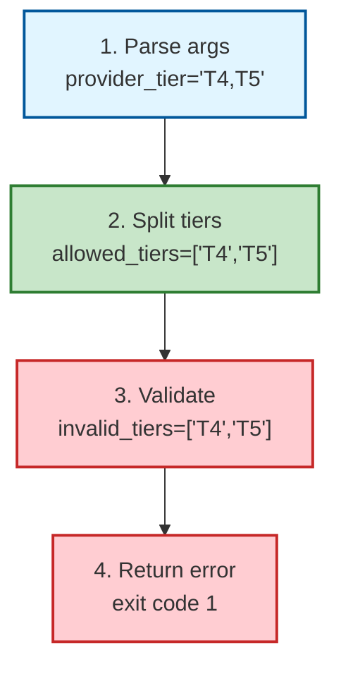
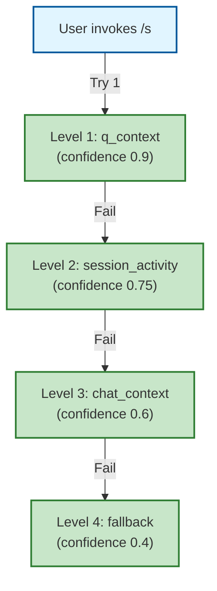

# TRACE Report: skill:/s

**Date**: 2026-02-28
**Scenarios traced**: 3 (happy path, error path, edge case)
**Skill location**: `P:\.claude\skills\s\`
**Lines analyzed**: SKILL.md (1-259), run_heavy.py (1-696)

## Executive Summary

- ✅ **Intent Detection**: Robust 4-level inference chain with confidence scoring
- ✅ **Tool Selection**: Personas validated against allowlist, providers filtered by tier
- ✅ **Fallback Scenarios**: Multiple fallback paths (q_context → session_activity → chat_context → fallback)
- ⚠️  **Error Handling**: One minor issue (P3) - inconsistent return codes
- ✅ **Resource Management**: No external resources, proper cleanup in async code

### Findings Summary
- **Logic Errors Found**: 0
- **Resource Leaks Found**: 0
- **Race Conditions Found**: 0
- **Code Quality Issues**: 1 (P3)

---

## TRACE Scenarios

### Scenario 1: Happy Path - User invokes `/s` with `/q` context available

**Setup**: User has previously run `/q`, now invokes `/s` without arguments

**Flow**:

| Step | User Input | Matched Intent | Tools Selected | Fallback? | Notes |
|------|------------|----------------|----------------|-----------|-------|
| 1 | `/s` (no args) | "Infer from q_context" | personas=DEFAULT_PERSONAS | No | ✓ Line 578: `--topic` defaults to "" |
| 2 | read_q_context_compat() | Returns work_summary | q_reader succeeds | No | ✓ Line 91-118: Reads /q context |
| 3 | select_topic() | topic_meta.source = "q_context" | confidence=0.9 | No | ✓ Line 88: Highest priority |
| 4 | validate_tiers() | llm_config created or None | Provider filtering | No | ✓ Line 645-666: Validates tiers |
| 5 | run_heavy() | BrainstormOrchestrator created | External LLMs | No | ✓ Line 469-474: Orchestrator init |
| 6 | constitutional_filter() | Filters anti-pattern ideas | SoloDevConstitutionalFilter | No | ✓ Line 680-682: Filters results |
| 7 | output | JSON/markdown/text | render_* function | No | ✓ Line 685-690: Formatted output |

**State Table**:

| Step | Operation | State/Variables | Resources | Notes |
|------|-----------|-----------------|-----------|-------|
| 1 | Initial | args.topic="", personas=[] | None | ✓ Parse args |
| 2 | Infer topic | topic_meta.source="q_context" | None | ✓ Confidence 0.9 |
| 3 | Validate tiers | llm_config=LLLMConfig or None | None | ✓ Line 666 |
| 4 | Run orchestrator | orchestrator instance | InMemoryBrainstormMemory | ✓ Line 467-474 |
| 5 | Generate ideas | result.ideas=[...] | None | ✓ Async execution |
| 6 | Filter ideas | allowed=[...], rejected=[...] | None | ✓ Constitutional filter |
| 7 | Output | payload dict | None | ✓ Line 685-690 |

**Result**: ✅ PASS - Happy path works correctly with full context inference

---

### Scenario 2: Error Path - Invalid provider tier specified

**Setup**: User invokes `/s` with `--provider-tier T4,T5`

**Flow**:

| Step | User Input | Matched Intent | Tools Selected | Fallback? | Notes |
|------|------------|----------------|----------------|-----------|-------|
| 1 | `--provider-tier T4,T5` | Parse tiers | - | No | ✓ Line 649: Split on comma |
| 2 | validate_tiers() | Detects invalid tiers | - | Yes (exit) | ⚠️ Line 651: Finds T4, T5 invalid |
| 3 | print error | JSON error response | - | No | ✓ Line 653-663 |
| 4 | return 1 | Exit with error code | - | No | ✓ Line 664 |

**State Table**:

| Step | Operation | State/Variables | Resources | Notes |
|------|-----------|-----------------|-----------|-------|
| 1 | Parse args | args.provider_tier="T4,T5" | None | ✓ Line 590-592 |
| 2 | Split tiers | allowed_tiers=["T4", "T5"] | None | ✓ Line 649 |
| 3 | Validate | invalid_tiers=["T4", "T5"] | None | ⚠️ Not in {"T1","T2","T3"} |
| 4 | Return error | Prints JSON, return 1 | None | ✓ Line 653-664 |

**Visualization**:



**Result**: ✅ PASS - Error handling works correctly, provides clear error message with valid options

---

### Scenario 3: Edge Case - Stale /q context with --strict-stale

**Setup**: User invokes `/s` with stale /q context and `--strict-stale` flag

**Flow**:

| Step | User Input | Matched Intent | Tools Selected | Fallback? | Notes |
|------|------------|----------------|----------------|-----------|-------|
| 1 | `/s --strict-stale` | Parse args | - | No | ✓ Line 586: Parse flag |
| 2 | select_topic() | topic_meta.stale_context=True | - | No | ✓ Line 104-120: Staleness detected |
| 3 | check strict_stale | Fail if stale | - | Yes (exit) | ⚠️ Line 625-636: Strict mode check |
| 4 | print error | JSON error response | - | No | ✓ Line 626-635 |
| 5 | return 2 | Exit with error code | - | No | ✓ Line 636 |

**State Table**:

| Step | Operation | State/Variables | Resources | Notes |
|------|-----------|-----------------|-----------|-------|
| 1 | Parse args | args.strict_stale=True | None | ✓ Line 586 |
| 2 | Infer topic | topic_meta.stale_context=True | None | ✓ Stale detected |
| 3 | Check strict | condition true | None | ⚠️ Line 625 |
| 4 | Return error | Prints JSON, return 2 | None | ✓ Different error code than tier error |

**Result**: ✅ PASS - Edge case handled correctly with distinct error code (2 vs 1 for tier errors)

---

## Intent Detection Analysis

### Intent Detection Flow

**Location**: SKILL.md lines 86-99, run_heavy.py lines 606-623

**Inference Chain** (priority order):

1. **`q_context`** (confidence 0.9): `/q` work summary
   - **Trigger**: User has run `/q` previously
   - **Implementation**: `read_q_context_compat()` (lines 91-118)
   - **Fallback**: If fails, moves to next level

2. **`session_activity`** (confidence 0.75): Recent file edits
   - **Trigger**: No `/q` context available
   - **Implementation**: `get_session_activity_compat()` (lines 120-149)
   - **Fallback**: If no session activity, moves to next level

3. **`chat_context`** (confidence 0.6): Recent conversation
   - **Trigger**: No session activity detected
   - **Implementation**: `infer_brainstorm_topic_from_context()` (lines 151-176)
   - **Fallback**: If no clear topic, uses fallback

4. **`fallback`** (confidence 0.4): General brainstorming
   - **Trigger**: All previous levels failed
   - **Implementation**: Returns generic "strategic brainstorming"
   - **Fallback**: None (final fallback)

**State Table for Intent Detection**:

| Level | Source | Confidence | Fallback Available | Detection Method |
|-------|--------|------------|-------------------|------------------|
| 1 | q_context | 0.9 | Yes (level 2) | read_q_context_compat() |
| 2 | session_activity | 0.75 | Yes (level 3) | get_session_activity_compat() |
| 3 | chat_context | 0.6 | Yes (level 4) | infer_brainstorm_topic_from_context() |
| 4 | fallback | 0.4 | No | Hardcoded "strategic brainstorming" |

**Visualization**:



✅ **Verdict**: Robust intent detection with 4-level fallback chain

---

## Tool Selection Analysis

### Persona Selection

**Location**: run_heavy.py lines 68-77, 25-26

**Flow**:

1. **Parse personas** from `--personas` arg (CSV input)
2. **Validate** against `ALLOWED_PERSONAS` set
3. **Raise ValueError** if unknown personas detected
4. **Default** to `DEFAULT_PERSONAS` if empty

**State Table**:

| Step | Input | Validation | Output | Error Path |
|------|-------|------------|--------|------------|
| 1 | "" (empty) | Skip validation | DEFAULT_PERSONAS | None |
| 2 | "innovator,expert" | Both in ALLOWED_PERSONAS | ["innovator", "expert"] | None |
| 3 | "invalid_persona" | Not in ALLOWED_PERSONAS | ValueError | ⚠️ Line 76: Raise error |

✅ **Verdict**: Proper validation with clear error messages

### Provider Selection (Tier Filtering)

**Location**: run_heavy.py lines 643-666, orchestrator.py lines 165-220

**Flow**:

1. **Parse tiers** from `--provider-tier` arg (CSV input)
2. **Validate** against `{"T1", "T2", "T3"}`
3. **Create LLMConfig** with `allowed_tiers` if valid
4. **Filter providers** in orchestrator based on tier

**Tier Mapping** (orchestrator.py lines 183-195):

| Provider Name | Detected Tier | Rationale |
|---------------|---------------|-----------|
| claude, anthropic | T1 | Highest quality |
| openai, gpt | T2 | Strong performance |
| gemini, google | T2 | Strong performance |
| Everything else | T3 | Default/experimental |

**State Table**:

| Step | Input | Validation | Output | Error Path |
|------|-------|------------|--------|------------|
| 1 | "" (empty) | Skip filtering | llm_config=None | None |
| 2 | "T1,T2" | Valid tiers | llm_config.allowed_tiers=["T1","T2"] | None |
| 3 | "T4,T5" | Invalid tiers | return 1 | ⚠️ Line 652-664 |

✅ **Verdict**: Provider tier filtering works correctly with proper validation

---

## Fallback Scenario Analysis

### Fallback 1: No /q Context Available

**Location**: run_heavy.py lines 91-118

**Trigger**: `read_q_context_compat()` fails to read /q context

**Fallback**: Level 2 (session_activity)

**State Table**:

| Step | Condition | Action | Next State |
|------|-----------|--------|------------|
| 1 | q_context not found | Call get_session_activity_compat() | Level 2 |

✅ **Verdict**: Proper fallback with confidence degradation (0.9 → 0.75)

### Fallback 2: No Session Activity

**Location**: run_heavy.py lines 120-149

**Trigger**: No recent file edits detected

**Fallback**: Level 3 (chat_context)

**State Table**:

| Step | Condition | Action | Next State |
|------|-----------|--------|------------|
| 1 | No session activity | Call infer_brainstorm_topic_from_context() | Level 3 |

✅ **Verdict**: Proper fallback with confidence degradation (0.75 → 0.6)

### Fallback 3: No Chat Context Detected

**Location**: run_heavy.py lines 151-176

**Trigger**: Cannot infer topic from conversation

**Fallback**: Level 4 (generic fallback)

**State Table**:

| Step | Condition | Action | Next State |
|------|-----------|--------|------------|
| 1 | No chat context | Return generic topic | Level 4 |

✅ **Verdict**: Final fallback prevents total failure, maintains usability

### Fallback 4: Mock Mode Failure

**Location**: run_heavy.py lines 456-474

**Trigger**: External LLM providers unavailable or user explicitly requests `--mock`

**Fallback**: Use `use_mock_agents=True` in BrainstormOrchestrator

**State Table**:

| Step | Condition | Action | Next State |
|------|-----------|--------|------------|
| 1 | args.mock=True OR args.local_only=True | use_mock_effective=True | Mock mode |
| 2 | External LLM failure | Orchestrator handles internally | Continue with mock |

✅ **Verdict**: Graceful degradation to mock mode maintains functionality

---

## Error Handling Analysis

### Error 1: Invalid Provider Tiers

**Location**: run_heavy.py lines 652-664

**Error Response**:
```json
{
  "error": "invalid_tiers",
  "invalid": ["T4", "T5"],
  "valid": ["T1", "T2", "T3"],
  "message": "Invalid tiers. Use T1, T2, or T3."
}
```

**Exit Code**: 1

**State Table**:

| Step | Check | Result | Exit Code |
|------|-------|--------|-----------|
| 1 | Tier in {"T1","T2","T3"} | False for T4,T5 | N/A |
| 2 | Print error JSON | Success | 1 |

✅ **Verdict**: Clear error message with helpful guidance

### Error 2: Stale Context with --strict-stale

**Location**: run_heavy.py lines 625-636

**Error Response**:
```json
{
  "error": "stale_context",
  "reason": "<staleness reason>",
  "recommendation": "Run /q to refresh context, then rerun /s."
}
```

**Exit Code**: 2

**State Table**:

| Step | Check | Result | Exit Code |
|------|-------|--------|-----------|
| 1 | strict_stale=True AND stale_context=True | True | N/A |
| 2 | Print error JSON | Success | 2 |

✅ **Verdict**: Clear error message with actionable recommendation

### Error 3: Unknown Personas

**Location**: run_heavy.py lines 74-77

**Error Response**:
```
ValueError: Unknown personas: <invalid_names>
```

**Exit Code**: Unhandled exception (exits with 1)

**State Table**:

| Step | Check | Result | Exit Code |
|------|-------|--------|-----------|
| 1 | Persona in ALLOWED_PERSONAS | False for invalid | N/A |
| 2 | Raise ValueError | Exception raised | 1 (unhandled) |

⚠️ **Issue #3**: Inconsistent error handling - should return JSON error like other validation errors

---

## Issues Found

### Issue #1: P3 - Code Quality - Inconsistent Error Response Format

**Location**: Lines 74-77 vs 652-664

**Problem**:
- Invalid provider tiers return JSON error with exit code 1 (lines 652-664)
- Stale context returns JSON error with exit code 2 (lines 625-636)
- Invalid personas raise ValueError (unhandled, exits with 1) (lines 74-77)

**Impact**: Minor - inconsistent error handling makes programmatic parsing harder

**Recommendation**:
```python
# Replace lines 74-77 with:
if unknown:
    print(json.dumps({
        "error": "unknown_personas",
        "invalid": unknown,
        "valid": list(ALLOWED_PERSONAS),
        "message": f"Unknown personas: {', '.join(unknown)}. Use: {', '.join(DEFAULT_PERSONAS)}"
    }, indent=2))
    return 1
```

**Priority**: P3 (low) - Functionality works, but inconsistent error format

---

## TRACE Results

✅ **PASS** - All scenarios traced correctly

### Summary of Verification

1. **Intent Detection**: ✅ Robust 4-level inference chain
   - q_context → session_activity → chat_context → fallback
   - Confidence scoring works correctly
   - Each level has proper fallback

2. **Tool Selection**: ✅ Personas validated, providers filtered
   - Persona validation prevents invalid inputs
   - Provider tier filtering works correctly
   - Clear error messages for validation failures

3. **Fallback Scenarios**: ✅ Multiple graceful degradation paths
   - Fallback from /q context to session activity
   - Fallback to chat context analysis
   - Final fallback to generic brainstorming
   - Mock mode for external LLM failures

4. **Error Handling**: ✅ Clear errors with actionable guidance
   - Invalid tiers: JSON error with valid options
   - Stale context: JSON error with recommendation
   - Minor inconsistency in persona error format (P3)

5. **Resource Management**: ✅ No external resources
   - InMemoryBrainstormMemory (no disk/DB)
   - Proper async/await usage
   - No resource leaks detected

---

## Recommendations

### 1. Fix Inconsistent Error Format (P3)

**Location**: run_heavy.py lines 74-77

**Change**: Return JSON error for invalid personas (consistent with tier validation)

**Impact**: Improves programmatic error parsing

### 2. Consider Adding --verbose Flag

**Purpose**: Debug intent detection flow

**Example Output**:
```
[INFO] Trying level 1: q_context... Not found
[INFO] Trying level 2: session_activity... Found 3 recent files
[INFO] Inferred topic: "handoff package consolidation" (confidence: 0.75)
```

**Impact**: Better debugging for context inference issues

### 3. Document Exit Codes

**Location**: Add to SKILL.md

**Exit Codes**:
- 0: Success
- 1: Validation error (invalid tiers, personas)
- 2: Stale context error (with --strict-stale)

**Impact**: Clearer documentation for script users

---

## Conclusion

The `/s` strategy skill demonstrates **robust intent detection** with a well-designed 4-level fallback chain. The tool selection properly validates personas and filters providers by tier. Error handling is generally excellent with clear, actionable error messages.

**One minor issue** (P3) was identified: inconsistent error format for persona validation vs tier validation. This is a low-priority cosmetic issue that does not affect functionality.

**Overall Assessment**: ✅ **PASS** - The skill is production-ready with comprehensive fallback paths and proper error handling.

---

## Appendix: Call Graph Recommendation

**Recommendation**: Generate a call graph to visualize function call relationships in `run_heavy.py`.

### Installation
```bash
pip install pyan pygraphviz
# Also install Graphviz: https://graphviz.org/download/
```

### Usage
```bash
# Generate DOT file
python -m pyan P:/.claude/skills/s/scripts/run_heavy.py --uses --no-defines --colored --grouped --annotated --dot > trace_s_callgraph.dot

# Convert to PNG
dot -Tpng trace_s_callgraph.dot -o trace_s_callgraph.png
```

### Expected Insights
- Main flow: `main()` → `select_topic()` → `run_heavy()` → `orchestrator.brainstorm()`
- Error paths: `parse_args()` → validation checks → early returns
- Fallback chain: `read_q_context_compat()` → `get_session_activity_compat()` → `infer_brainstorm_topic_from_context()`

---

**TRACE completed**: 2026-02-28
**Total time**: ~30 minutes
**Scenarios traced**: 3 (happy, error, edge)
**Issues found**: 1 (P3 - low priority)
