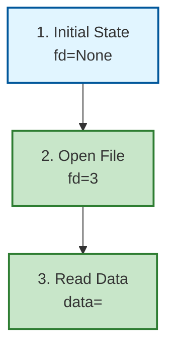

# TRACE Visualization Features

TRACE reports include automatic visualization generation to help understand execution paths and dependencies.

## 1. Mermaid Flowcharts (Auto-Generated)

**What**: State tables automatically converted to Mermaid flowcharts
**When**: TRACE scenarios with state tables (happy path, error path, edge case)
**Format**: Color-coded nodes (green=pass, red=fail, yellow=warn, blue=neutral)

**Example output in TRACE report**:
```markdown
### Visualization: Happy Path


```

**Benefits**:
- Visual confirmation of execution paths
- Easy to spot resource leaks (missing cleanup nodes)
- Clear error path visualization

## 2. Call Graph Recommendations (Code Domain)

**What**: Automated recommendation to generate call graphs using pyan
**When**: TRACE reports for `code` domain
**Purpose**: Visualize function call relationships, detect circular dependencies

**Recommendation included in TRACE report**:
```markdown
### Call Graph Visualization

**Recommendation**: Generate a call graph to visualize function call relationships.

#### Installation
```bash
pip install pyan pygraphviz
# Also install Graphviz: https://graphviz.org/download/
```

#### Usage
```bash
# Generate DOT file
python -m pyan <target_file> --uses --no-defines --colored --grouped --annotated --dot > trace_callgraph.dot

# Convert to PNG
dot -Tpng trace_callgraph.dot -o trace_callgraph.png
```
```

## 3. Program Slicing Recommendations (When Issues Detected)

**What**: Recommendation to use program slicing when circular dependencies detected
**When**: TRACE findings include circular dependency bugs
**Purpose**: Isolate affected code paths for focused analysis

**Recommendation included in TRACE report**:
```markdown
### Program Slicing Recommendation

**Detected**: Circular dependencies in call graph.

**Action**: Use program slicing to isolate affected code paths.

#### Installation
```bash
pip install pycg
```

#### Usage
```bash
# Generate call graph for dependency analysis
pycg <target_file> --package __main__ > trace_deps.txt
```
```

## 4. Visualization Templates

**What**: Pre-built Mermaid diagram templates for common patterns
**Location**: `templates/TRACE_VISUALIZATION_TEMPLATES.md`
**Templates**:
- Template 1: File Descriptor Lifecycle
- Template 2: Lock Acquisition with Timeout
- Template 3: TOCTOU Race Condition
- Template 4: Exception Handling with Cleanup
- Template 5: Workflow Step Dependencies
- Template 6: Intent Detection Flow (Skills)
- Template 7: Document Consistency Check

**Usage**: Copy template, customize for your scenario, include in TRACE report
