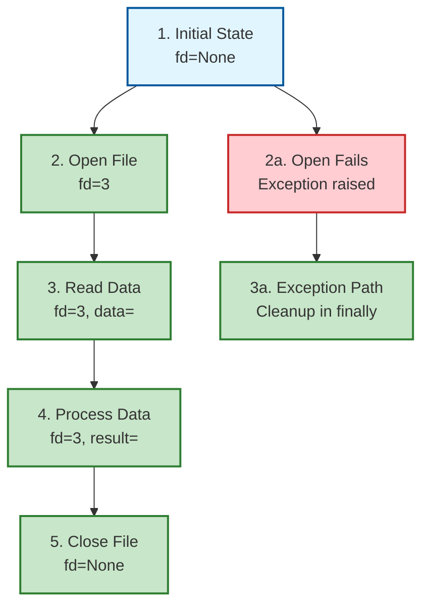
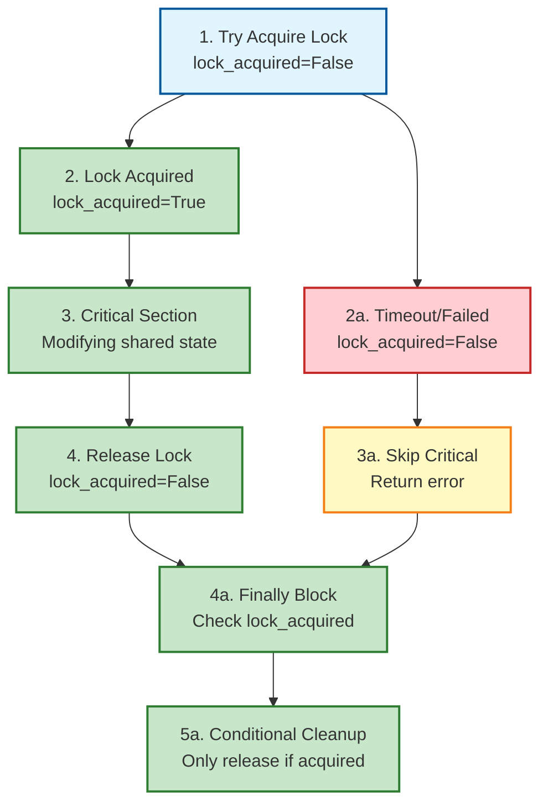
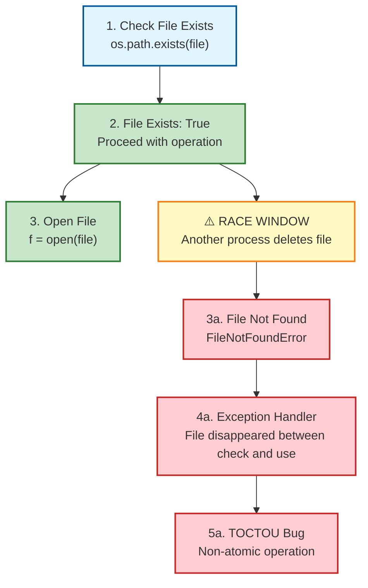
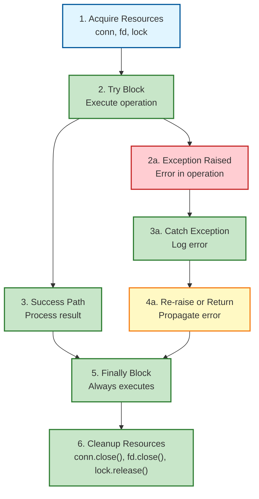
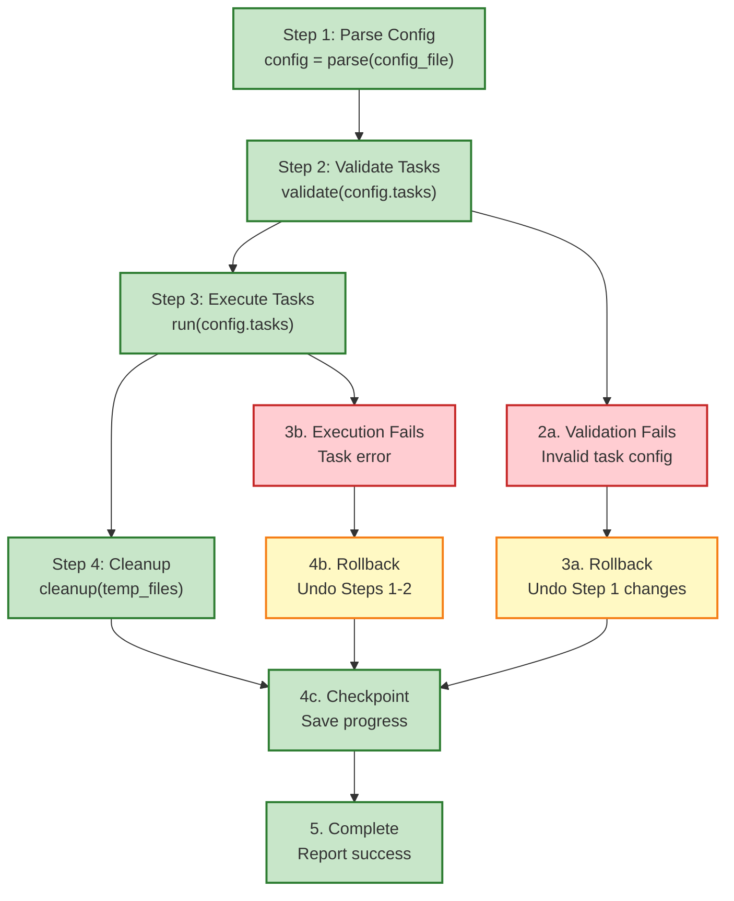
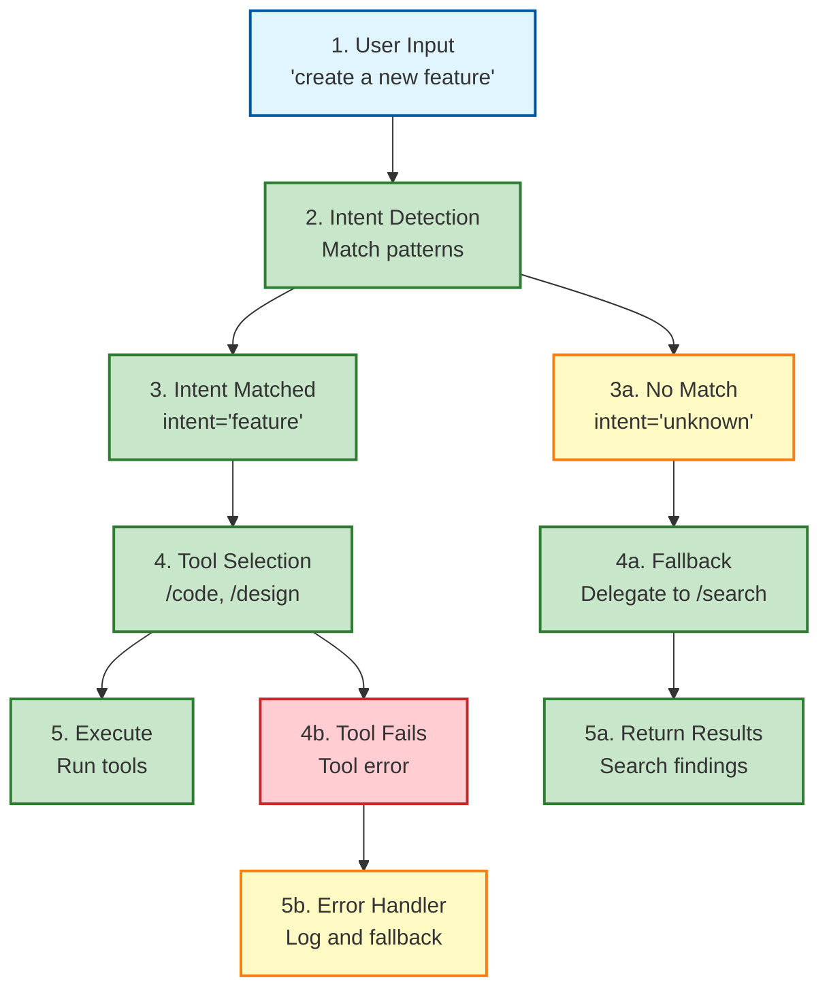
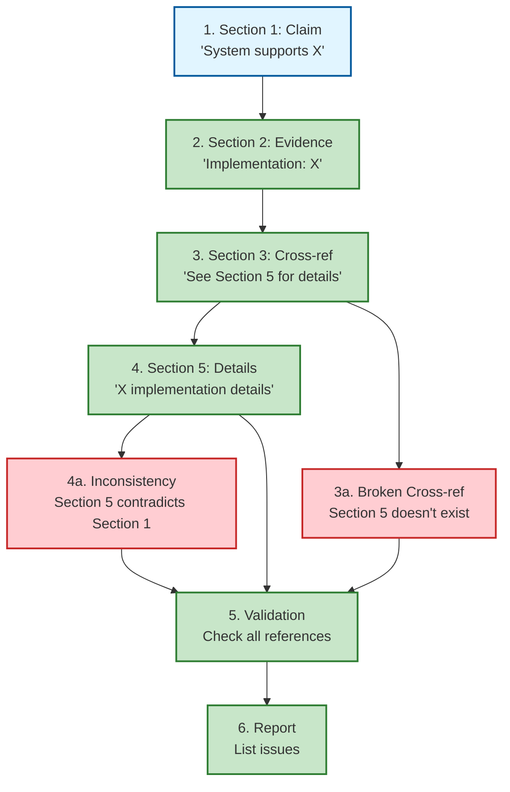

# TRACE Visualization Templates

Pre-built Mermaid diagrams for common TRACE patterns. Use these templates to document and communicate TRACE findings.

## Template 1: File Descriptor Lifecycle

**When to use**: Tracing file I/O operations, resource acquisition/release



**Key observations**:
- Resource acquisition (fd=3) at step 2
- Resource used at steps 3-4
- **Critical**: Resource released at step 5 in all paths
- Exception path (2a → 3a) also releases resource

---

## Template 2: Lock Acquisition with Timeout

**When to use**: Tracing concurrent access, locking mechanisms



**Key observations**:
- **Critical**: Finally block checks `lock_acquired` before releasing
- Prevents deleting another process's lock
- Both success and failure paths converge on cleanup

---

## Template 3: TOCTOU Race Condition

**When to use**: Tracing check-then-act patterns, time-of-check-time-of-use bugs



**Key observations**:
- **BUG**: Race window between check (step 1) and use (step 3)
- **Fix**: Use atomic operation (e.g., `os.open(file, os.O_CREAT | os.O_EXCL)`)
- Another process can delete file during the race window

---

## Template 4: Exception Handling with Cleanup

**When to use**: Tracing exception paths, resource cleanup in error scenarios



**Key observations**:
- Both success (B → C) and error (B → D → E → F) paths converge on finally (G)
- **Critical**: Cleanup happens regardless of exception
- All resources released in finally block (H)

---

## Template 5: Workflow Step Dependencies

**When to use**: Tracing workflow execution, step dependencies, rollback paths



**Key observations**:
- Clear dependency chain: Step 1 → Step 2 → Step 3 → Step 4
- Each failure path has explicit rollback (F, H)
- Checkpoint (I) saves progress for recovery
- All paths converge on completion (J)

---

## Template 6: Intent Detection Flow (Skills)

**When to use**: Tracing skill intent detection, tool selection, fallback scenarios



**Key observations**:
- Intent detection (B) branches to matched (C) or unmatched (F)
- Matched path: Select tools (D) → Execute (E)
- Unmatched path: Fallback to /search (G → H)
- Tool failure (I) triggers error handler (J)

---

## Template 7: Document Consistency Check

**When to use**: Tracing document reviews, cross-reference validation



**Key observations**:
- Cross-reference check (C → D) validates target section exists
- Consistency check (D → F) validates content matches claims
- All issues collected and reported (G → H)

---

## How to Use These Templates

### Step 1: Select Template
Choose the template that matches your TRACE scenario:
- File I/O → Template 1
- Locking → Template 2
- Race conditions → Template 3
- Exception handling → Template 4
- Workflows → Template 5
- Skills → Template 6
- Documents → Template 7

### Step 2: Customize Nodes
Replace placeholder text with actual operations from your code:
- `["1. Your Operation<br/>var=value"]`

### Step 3: Apply Styles
Use style classes to indicate status:
- `:::pass` for correct operations (green)
- `:::fail` for bugs/errors (red)
- `:::warn` for warnings (yellow)
- `:::default` for neutral (blue)

### Step 4: Add to TRACE Report
Include the Mermaid diagram in your TRACE report:
```markdown
### Visualization: Happy Path

```mermaid
[Your customized diagram]
```
```

---

## Creating Custom Templates

For patterns not covered here, create custom diagrams following this structure:

1. **Nodes**: Each step in the TRACE
   - Format: `["Step number: Description<br/>State"]`
   - Use `:::class` for styling

2. **Edges**: Arrows showing flow
   - Success path: `-->`
   - Exception path: `-->|condition|`

3. **Styles**: Color coding
   - `pass`: Green (correct)
   - `fail`: Red (bug)
   - `warn`: Yellow (warning)
   - `default`: Blue (neutral)

4. **Layout**: Flowchart
   - `flowchart TD` for top-down
   - `flowchart LR` for left-right

---

## Integration with TRACE Reports

The `/trace` skill automatically generates Mermaid diagrams from state tables. To use custom templates:

1. **Auto-generated** (default):
   - Use `state_table_to_mermaid()` in TraceReport
   - Automatically creates diagrams from TRACE scenarios

2. **Custom templates** (manual):
   - Copy template from this file
   - Customize for your specific scenario
   - Include in TRACE report markdown

---

## See Also

- **TRACE Methodology**: `TRACE_METHODOLOGY.md`
- **Code TRACE Templates**: `code/TRACE_TEMPLATES.md`
- **Code TRACE Case Studies**: `code/TRACE_CASE_STUDIES.md`
